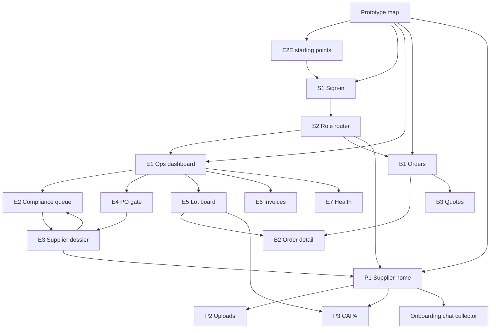

# Middleware Interactive Dashboard and End-to-End Flows

**Status:** Proposed (Phase 0 UX; extends Workstream 2)  
**Date:** 2026-08-13  
**Owner:** IPCo  
**Depends on:** `2026-08-14-middleware-ux-design.md` (PR #8), `2026-08-13-supplier-onboarding-chat-collector-design.md`, locked fabric spec  
**Figma:** [Sattva Middleware](https://www.figma.com/design/NcyHhLoppe3f72fs5KjrvP) (`NcyHhLoppe3f72fs5KjrvP`)  
**Clickable twin (source of truth while MCP is capped):** `docs/superpowers/mocks/sattva-middleware-portal.html`

The Workstream 2 file already has lo-fi frames (persona index, E1, E2, B2, P2). This spec is the **interactive ops dashboard**: every KPI, row, and resource chip is a live jump to another dashboard, and three end-to-end flows can be walked without leaving the portal metaphor.

Figma MCP on the Starter/View seat is at the monthly tool-call cap (`whoami` still works; `use_figma` / `get_metadata` do not). Prototype connections below are the exact reactions to apply in file `NcyHhLoppe3f72fs5KjrvP` when a Full/Dev seat or a new month is available. Until then, the HTML twin is the reviewable interactive artifact.

Open the twin locally (`python3 -m http.server` from `docs/superpowers/mocks/`) and land on `#/map`.

---

## 1. What “interactive dashboard” means

The middleware is still a BFF with **no business state**. Interactivity is navigation and role filtering, not a second CRM.

| Surface | Does | Does not |
| --- | --- | --- |
| Prototype map (`#/map`) | Shows every screen as a tile with labelled edges | Store leads, POs, or files |
| E1 Ops dashboard | Deep-links to E2–E7, Odoo (employees), Notion SOPs | Become a reporting warehouse |
| Resource rail | Role-filtered links to other portal dashboards | Nextcloud hostname for buyers/suppliers |
| Flow dock | Steps a persona through a happy/blocked path; pulses the next hotspot | Bypass the PCP gate |
| HTML twin | Hash routes that work offline in git | Talk to live Odoo |

**Active reference links** are in-portal `#/` routes plus labelled external targets (Odoo, Notion). External targets never carry vault credentials. Buyers and suppliers never see `vault.trilokventures.org` or `n8n.trilokventures.org`.

---

## 2. Information architecture

---

## 3. Dashboard link matrix (wire these as Figma prototype clicks)

On each frame, the **left nav** and **resource rail** use the same targets. HTML hotspots use `data-hotspot` keys listed in §5.

### 3.1 E1 KPI cards

| Control | Goes to | Copy |
| --- | --- | --- |
| Pending PCP reviews | E2 | “4 suppliers in review” |
| PO gate blocked today | E4 | “2 confirms blocked” |
| Lots in quarantine | E5 | “3 lots waiting COA” |
| Unpaid invoices | E6 | Finance only; hidden from sales |
| n8n failures (from E7 card if IT) | E7 | IT only |
| Activity row `po.blocked` | E4 with PO highlighted | AMBER event, no PDF |
| Activity row `vendor.pcp_status_changed` | E3 | Status + Odoo URL |
| Activity row `lot.coa_verified` | E5 | Pass/fail + hash, no file |
| Resource: Qualification SOP | Notion AMBER SOP | Process wiki |
| Resource: Onboarding chat | HTML/Figma chat collector | Seller pack |

### 3.2 Cross-dashboard references (every screen’s rail)

| From | Active references |
| --- | --- |
| Map | Flows, E1, B1, P1 |
| S1 | S2 |
| S2 | E1, B1, P1 |
| S3 | E4, E3, E5 |
| E1 | E2, E4, E5, S3 |
| E2 | E3, E1 |
| E3 | E2, E4, P1 peek |
| E4 | E3 (overlay + row), E1 |
| E5 | B2 GREEN, P3 CAPA |
| B1 | B2, B3 |
| B2 | B1, B3 |
| P1 | P2, chat, P3 |
| P2 | P1 (status → `review`) |

E2 row click → E3. E3 **Approve in Odoo** returns to E2 (status `approved`). E3 **Request more** / **Seller home** → supplier P1. E4 blocked confirm → overlay with **View supplier compliance → E3**. E4 never offers Confirm anyway.

B1 card → B2. B2 lot metrics are GREEN only (moisture %, mesh pass, pass/fail, hash). No vault path.

P1 checklist item → P2 slot. P1 **Continue onboarding** → chat collector. P2 success hash stays; path is not shown to the supplier.

---

## 4. End-to-end flows (playable)

Fictional names only: supplier **Example Foods Pvt Ltd**, buyer **Northshore Foods Inc**, PO **P00042**, sale **SO-1042**.

HTML: `#/flows` then Play employee / buyer / seller. The dock pulses the next hotspot; Back / Next / step pills jump the same graph Figma should prototype.

### 4.1 Employee — quote to blocked confirm to approval (10 steps)

1. S1 as `sales.exec`.
2. S2 → employee ops.
3. E1: KPI “2 confirms blocked” → E4.
4. E4: Confirm P00042 → overlay **Compliance Gate Blocked** (Example Foods is `review`, missing pest log).
5. Overlay **View supplier compliance → E3**.
6. E3 dossier is read-only for sales (SoD). Peek P1 optional.
7. Sign out; S1 as `compliance.officer`.
8. E2 → Example Foods row → E3.
9. E3 **Approve in Odoo** (sales clicking Approve is refused in the twin).
10. Sales E4: gate pill green; confirm succeeds. PO state is Odoo’s; portal only displays it.

### 4.2 Buyer — GREEN lot status (5 steps)

1. S1 as `buyer`.
2. S2 → B1.
3. B1: SO-1042 card.
4. B2: timeline contract → production → CFIA clear → delivered; GREEN metrics; released docs only.
5. B3 quotes loop back to B1. Vault / supplier-folder URLs are absent from the chrome.

### 4.3 Seller — onboarding pack to review (6 steps)

1. S1 as `supplier` (account provisioned, not self-registered).
2. S2 → P1.
3. P1: PCP banner `pending`, checklist 4/12 → P2.
4. P2: remaining PCP slots; hash receipt; return home marks `review`.
5. P1 banner becomes `review`. No PO.
6. P3 CAPA is a separate path; it does not approve the supplier. Officer path is 4.1.

---

## 5. Figma pass when MCP quota resets

File [Sattva Middleware](https://www.figma.com/design/NcyHhLoppe3f72fs5KjrvP). Existing frames: `00 · Persona Index`, `E1 · Ops Dashboard`, `E2 · Compliance Review Queue`, `B2 · Buyer Order Detail`, `P2 · Supplier Document Upload`.

Add frames to match §2 (Map, Flows, S1–S4, E3–E7, B1, B3, P1, P3, E4 overlay). Capture the HTML twin with `generate_figma_design` (write path; listed as rate-limit exempt) from `http://127.0.0.1:<port>/sattva-middleware-portal.html#/<screen>` if `use_figma` is still capped.

Prototype reactions (ON_CLICK → NAVIGATE, instant; overlay for the gate dialog):

| Starting point name | First frame |
| --- | --- |
| Employee flow | S1 (persona sales) |
| Buyer flow | S1 (persona buyer) |
| Seller flow | S1 (persona seller) |

| Source hotspot | Destination |
| --- | --- |
| Map tiles | matching S/E/B/P frame |
| Map starting-point cards | Flows |
| Flows Play employee/buyer/seller | S1 with that persona |
| S1 Sign in | S2 |
| S2 Employee / Buyer / Seller cards | E1 / B1 / P1 |
| E1 KPI Pending PCP | E2 |
| E1 KPI PO blocked | E4 |
| E1 KPI Lots | E5 |
| E1 KPI Invoices | E6 |
| E2 row Example Foods | E3 |
| E4 Confirm | Overlay “Compliance Gate Blocked” |
| Overlay View supplier compliance | E3 |
| E3 Back to queue | E2 |
| E3 Seller home peek | P1 |
| E5 Available L-882 | B2 |
| E5 CAPA | P3 |
| B1 SO-1042 | B2 |
| B2 Quotes | B3 |
| P1 Uploads | P2 |
| P1 Continue onboarding | chat collector file / frame |
| P2 Return home | P1 |

Persona index cards (existing `00 · Persona Index`) click to E1 / B1 / P1.

Until that pass, treat the HTML twin as the interactive source of truth.

---

## 6. Out of scope

Live Odoo/n8n wiring, Keycloak, real Nextcloud uploads, HubSpot, LifeOS, storing RED in the prototype, a fifth PCP status, Confirm anyway.

---

## 7. Promotion

Git is canonical. Notion Workstream 2 row should point at this spec, the HTML twin (`#/map`), and the Figma file. Do not put event payloads with partner PII in GREEN Content.
