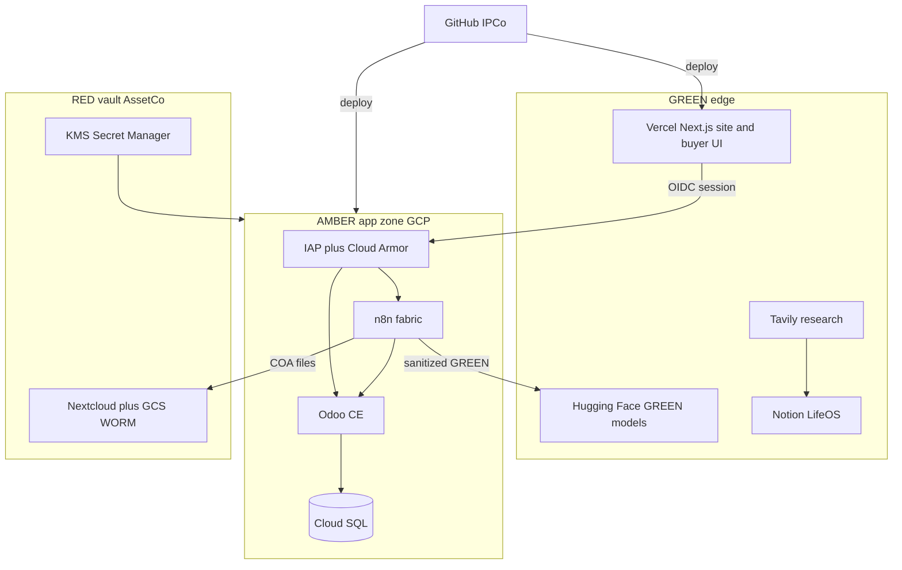

# Sattva Brokers System Fabric

**Status:** Locked design (Phase 0)  
**Date:** 2026-08-13  
**Approach:** Odoo-centric  
**Owner:** Sattva Brokers OpCo (operations); IPCo (software and workflow definitions)  
**Repo:** `trilok-ventures/sattva-odoo-infra`

This document is the operating spec for Sattva Brokers as a system: purpose, parts, rules, and the single tool fabric that implements them. It supersedes conflicting stack notes that listed AWS, Confluence, or HubSpot as systems of record.

---

## 1. Purpose

Sattva Brokers is a CFIA-compliant import brokerage for dehydrated spices and allied ingredients (onion, garlic, and related dehydrated vegetables). Product moves from verified Indian manufacturers to Canadian food processors, wholesalers, and copackers.

Sattva does not hold inventory. Value is documentation accuracy, supplier vetting, preventive-control evidence, logistics coordination, and lot-level traceability.

**Mission:** Bridge Indian manufacturers and Canadian food businesses through compliance-assured brokerage.

**Vision:** Become Canada’s trusted brokerage platform for dehydrated and ethnic food ingredients, known for integrated compliance systems and ERP-based operations.

**Success criteria for this fabric**

1. A supplier cannot become a purchasable counterparty until a compliance officer marks them PCP-approved.
2. Every sellable lot has a hashed COA in the vault and a matching Odoo record.
3. One system of record exists per domain. Duplicate CRMs, ledgers, or file vaults are out of scope.
4. RED data (COA PDFs, PII, vault files) never reaches marketing tools, Hugging Face, or Vertex AI.
5. A new tool is added only if it closes a deal, reduces compliance risk, or shortens the cash cycle.

**Core operating loop**

Lead → compliance review → contract → lot quarantine → COA verify → CFIA clear → invoice → 7-year dossier.

---

## 2. Parts

The operating system is nine functions, not nine software products.

| Function | What it does | Depends on |
| --- | --- | --- |
| Sales | Pipeline, quotes, brokerage offers | Odoo CRM |
| Supplier & procurement | Vet manufacturers, scorecards, PO intent | Odoo Purchase + compliance fields |
| Compliance & QA | PCP, HACCP evidence, CAPA, lot release | Odoo gates + Nextcloud vault |
| Logistics | Freight, insurance, customs coordination | Odoo inventory/shipment records |
| Finance | Commission invoices, duty, funds segregation | Odoo Accounting |
| IT & identity | Access, backups, integration bus | GCP + n8n + Secret Manager |
| Marketing | LinkedIn/content, GREEN collateral | Vercel site + Notion + Tavily |
| Business intelligence | Forecasts, KPIs, what-if | GREEN extracts from Odoo |
| People / HR | Role assignment that drives access | Odoo HR later; Keycloak in Phase 3 |

**Corporate allocation**

- **HoldCo:** ownership, capital, shared policy.
- **Sattva Brokers OpCo:** food-compliance workflow, customer contracts, supplier relationships, money movement.
- **IPCo:** portal code, n8n workflow JSON, Odoo addon source, brand assets.
- **EquipCo / AssetCo:** keys, WORM storage, production infra licensed into OpCo.

Food-compliance liability stays in OpCo. Software stays in IPCo.

---

## 3. Rules

### 3.1 One system of record per domain

| Domain | System of record | Explicitly not SoR |
| --- | --- | --- |
| Leads, quotes, sales orders, POs, invoices, partners | Odoo CE | HubSpot, Notion databases, spreadsheets |
| COA PDFs, PCP packs, certificates, labels | Nextcloud (+ GCS WORM in production) | Slack, email, local disks |
| Workflow orchestration | n8n (pass-through only; no business state) | Ad-hoc scripts |
| Policies, SOPs, decisions, meeting notes | Notion / LifeOS | Confluence |
| Source code, IaC, n8n JSON | GitHub (IPCo) | Unversioned n8n UI copies |
| Public marketing + buyer UI | Vercel | Odoo website module |
| Secrets | GCP Secret Manager (AssetCo) | `.env` committed to git, Notion |
| Market research drafts | Tavily → Notion | Pasting into Odoo chatter |
| ML inference | Hugging Face org `Trilok-Ventures` (GREEN only) | Running models on vault PDFs |

### 3.2 Compliance gates

The Odoo addon `sattva_compliance` is the supplier firewall:

- `res.partner.supplier_pcp_status` ∈ {pending, review, approved, blocked}.
- `purchase.order.button_confirm` raises `UserError` unless status is `approved`.
- `res.partner.nextcloud_folder_path` is the vault pointer. Phase 1 provisions this path on partner create; Phase 0 records the contract only.

A compliance officer—not sales—moves a supplier from `review` to `approved` after HACCP/sanitation evidence is in the vault.

### 3.3 Data classification

| Class | Examples | Allowed destinations |
| --- | --- | --- |
| RED | COA PDFs, passports, bank details, full lab reports, WORM vault | Nextcloud, GCS WORM, Cloud SQL encrypted columns, Secret Manager |
| AMBER | Partner names, prices, Incoterms, PO lines, CRM notes | Odoo, n8n in transit, Notion with RBAC |
| GREEN | Moisture %, mesh pass rate, pass/fail flags, hashed COA refs, public specs | Vercel UI, Hugging Face, Tavily briefs, marketing |
| PUBLIC | Brand copy, generic product sheets | Vercel marketing site |

Rule: Hugging Face, Vertex AI, Tavily, and HubSpot (if enabled later) receive GREEN only. n8n may *move* RED files into Nextcloud; it must not persist RED payloads in workflow execution logs.

### 3.4 Separation of duties

- Sales cannot confirm a PO for an unapproved supplier.
- Sales cannot modify price lists (enforced in Phase 1 Odoo ACLs).
- The person who creates a PO cannot be the sole payment approver (finance SoD).
- n8n workflow edits require code review; production JSON lives in GitHub.

### 3.5 Retention

PCP evidence, COAs, and trace dossiers: 7 years. n8n writes a retention log when moving AMBER working copies to archive. Destruction before 7 years is forbidden.

### 3.6 Stop list

No new tool, deck, or architecture unless it closes a deal, reduces compliance risk, or shortens the cash cycle. Digital Trust extras (Vault PKI, Wazuh, mTLS, Tauri client) wait until Phase 3.

---

## 4. Architecture

Odoo CE is the operational hub. n8n is the only integration bus. Nextcloud is the evidence vault. Notion is the human knowledge plane. Vercel is the GREEN edge. GCP is the production runtime.

**Local Phase 1 topology** (this repo, before GCP): Docker Compose on `sattva_cloud_net` runs Odoo 18, Postgres 15, n8n, Nextcloud, and Redis. Redis is n8n’s queue backend, not a second SoR.

**Production Phase 3 topology:** GCP org Trilok Ventures → folder Sattva Brokers OpCo. Cloud Armor + Identity-Aware Proxy in front of GKE (or Cloud Run if GKE is still oversized). Cloud SQL for Odoo. Nextcloud files on GCS with object retention (WORM). Secret Manager in AssetCo folder, licensed into OpCo. Vertex AI only after Cloud DLP strips RED/AMBER.

---

## 5. Components

### 5.1 Odoo CE 18 (SoR)

**Use:** CRM pipeline (Discovery → Proposal → Compliance Review → Contract → Execution → Retention), purchase orders, invoices, partner master, PCP status.

**Existing code**

- Addon: `addons/sattva_compliance`
- Partner fields: `supplier_pcp_status`, `risk_band`, `haccp_certified`, `brc_certified`, `nextcloud_folder_path`
- PO confirm gate in `addons/sattva_compliance/models/purchase_order.py`

**Phase 1 additions (specified, not built in Phase 0)**

- Provision Nextcloud folder on vendor create; write path back to `nextcloud_folder_path`.
- Lot/quarantine status on stock or a lightweight brokerage lot model if stock is unused.
- Role groups: `sales.exec`, `compliance.officer`, `finance.manager`, `logistics.exec`.

Odoo is the only place money, lots, and partner legal identity live.

### 5.2 n8n (fabric)

**Use:** Glue. Triggers from Odoo webhooks, Nextcloud uploads, IMAP, and cron. n8n stores credentials, not lots or invoices.

**First production workflow (proves the fabric)**

1. Nextcloud webhook: `COA.pdf` uploaded under `/Clients/{X}/Orders/{SO}/COA`.
2. n8n downloads the file, fetches the Odoo order spec and lot.
3. OCR extracts moisture, mesh, TPC (GREEN numbers).
4. Compare to spec thresholds.
5. Pass: set Odoo compliance flag, attach hash, notify.
6. Fail: set pending, open CAPA activity, notify compliance.

Workflow JSON is committed to GitHub. UI-only edits in production are forbidden.

**n8n does not:** keep a customer list, issue invoices, or serve as a document archive.

### 5.3 Nextcloud (vault)

**Use:** RED/AMBER files. Folder convention:

- `/PCP/Supplier_Audits/`
- `/PCP/Hazard_Control/`
- `/PCP/Verification_Records/`
- `/PCP/CAPA/`
- `/PCP/Consumer_Protection/`
- `/PCP/Training_Evidence/`
- `/PCP/Retention_Logs/`
- `/Clients/{name}/Orders/{order}/`
- `/Suppliers/{name}/Certificates/`

WebDAV + webhooks only. No public share links for RED files.

### 5.4 Notion / LifeOS (knowledge)

**Use:** SOPs, decisions, department wikis, this spec’s published twin. Transactional records do not originate here. Existing department pages under the Sattva Brokers hub remain the navigation surface.

### 5.5 GitHub (IPCo)

**Use:** `sattva-odoo-infra` and future portal repos. Signed commits for infra. n8n exports and Odoo addons versioned here.

### 5.6 Vercel (GREEN edge)

**Team:** `archneo-6267s-projects` (`team_umcW7U7OAQu6ffIvX8haPgnP`).

**Use:** Marketing site and buyer read-only lot status (Phase 2). Talks to Odoo through an authenticated API. No direct Nextcloud access from the browser.

### 5.7 GCP (runtime)

**Use:** Production home for Odoo, n8n, Nextcloud, Cloud SQL, IAP, Cloud Armor, DLP, Secret Manager. Replaces AWS mentions in the one-page business plan. Proxmox/Digital Trust remains a lab pattern until Phase 3 justifies it.

### 5.8 Tavily (research)

**Use:** GREEN market and regulatory research into Notion briefs for Marketing and BI. Never indexed against vault files.

### 5.9 Hugging Face (`Trilok-Ventures`)

**Use:** GREEN OCR/classification and later lead scoring. Input is extracted numbers and hashes, never source PDFs. Vertex AI may replace or complement this in GCP after DLP.

### 5.10 HubSpot (deferred overlay)

Not a CRM. If authenticated later, n8n copies new HubSpot contacts into Odoo `crm.lead` one-way. Odoo remains canonical. Dual pipelines are forbidden.

### 5.11 Explicitly out of fabric

| Item | Disposition |
| --- | --- |
| Confluence | Replaced by Notion |
| AWS as primary cloud | Replaced by GCP |
| HubSpot as CRM | Deferred overlay only |
| Tauri supplier client | Phase 2+ |
| Vault PKI, Wazuh, mTLS, WireGuard | Phase 3 Digital Trust |
| Odoo website as public site | Vercel instead |

---

## 6. Data flow

### 6.1 Supplier onboarding

1. Sales or procurement creates vendor in Odoo (`supplier_pcp_status = pending`).
2. n8n creates `/Suppliers/{name}/Certificates/` in Nextcloud and writes `nextcloud_folder_path`.
3. Certificates land in Nextcloud (upload or IMAP).
4. Compliance reviews evidence, sets `review` then `approved` or `blocked`.
5. Only then can a PO confirm.

### 6.2 Lot verification (fabric proving path)

Nextcloud COA upload → n8n OCR → compare to Odoo spec → GREEN fields + PDF hash on the lot → pass releases “available for sale”; fail opens CAPA. The PDF stays in Nextcloud (RED). Odoo stores the hash and GREEN metrics.

### 6.3 Buyer quote to cash

Odoo CRM stage movement → quote → contract → shipment coordination records → CFIA clear flag → invoice. Buyer UI (Phase 2) reads GREEN status only.

### 6.4 Research to content

Tavily query → Notion brief → human edits → Vercel/LinkedIn. No Odoo write from Tavily.

### 6.5 Identity (Phase 1 vs Phase 3)

Phase 1: Docker credentials and Odoo users.  
Phase 3: IAP + Keycloak/OIDC. n8n and Nextcloud consume the same IdP. Browser never holds vault credentials.

---

## 7. Error handling

| Failure | Behaviour |
| --- | --- |
| PO confirm on non-approved supplier | Odoo `UserError`; no partial confirm |
| Nextcloud webhook timeout | n8n retries 3 times with backoff; then Slack/email to IT; lot stays quarantined |
| OCR cannot parse COA | Lot stays quarantined; compliance activity created; no auto-approve |
| Spec mismatch | CAPA in Odoo; notify compliance; do not notify buyer of GREEN “available” |
| n8n down | Odoo and Nextcloud stay up; queue drains on recovery; watchdog cron (Phase 1) alerts |
| Duplicate HubSpot lead (if overlay exists) | Match on email into existing Odoo partner/lead; do not create a second pipeline |
| RED payload detected bound for HF/Tavily | n8n drops the call; logs a classification violation (metadata only) |
| Secret missing | Service refuses to start; do not fall back to committed passwords |

Quarantine is the default. Availability for sale is an affirmative compliance action.

---

## 8. Testing

Phase 0 (this commit): document review only — no runtime tests.

Phase 1 acceptance (implementation plan, not this commit)

1. Addon installs on Odoo 18; partner form shows PCP fields.
2. Confirming a PO for `pending` / `review` / `blocked` raises the gate error.
3. Confirming a PO for `approved` succeeds.
4. Creating a vendor creates a Nextcloud folder and stores the path.
5. Dropping a sample COA into the folder runs the n8n workflow in a local stack; pass and fail fixtures both behave as specified.
6. n8n execution logs contain GREEN fields and hashes, not PDF bytes.

Phase 2: buyer UI shows GREEN lot status for an authenticated test buyer and never returns file bytes from Nextcloud.

Phase 3: IAP blocks unauthenticated Odoo; DLP job refuses a RED fixture destined for HF.

---

## 9. Phased delivery

### Phase 0 — this document (complete when spec + Notion capture land)

Write and publish this spec. Capture the same decisions in Notion under the Sattva Brokers hub. Do not change `docker-compose.yml`. Do not deploy GKE. Do not enable HubSpot.

### Phase 1 — local fabric (separate implementation plan)

Extend Compose with n8n, Nextcloud, Redis. Keep the PO firewall. Provision vault folders. Commit the COA workflow JSON. Map Odoo groups to the RBAC names above.

### Phase 2 — GREEN edge

Vercel marketing site + read-only buyer lot status. Tavily → Notion briefs. Hugging Face OCR on GREEN extracts.

### Phase 3 — production and Digital Trust

GCP OpCo runtime, dual portal, optional HubSpot overlay, WORM bucket, IAP, DLP, then PKI/SIEM if a live CFIA audit or enterprise buyer requires it.

---

## 10. Decisions

| Decision | Choice | Rejected | Rationale |
| --- | --- | --- | --- |
| Operating hub | Odoo CE | HubSpot-centric OS | Already in repo; CRM + PO + invoice in one SoR; charter forbids two CRMs |
| Integration bus | n8n | Point-to-point scripts, Confluence automation | Existing COA workflow design; GitHub-versionable JSON |
| File vault | Nextcloud | Drive, Notion files, Odoo attachments as archive | Partner path field already exists; RED isolation |
| Knowledge | Notion / LifeOS | Confluence | Hub and SOPs already live there |
| Production cloud | GCP | AWS, Proxmox-first | GCP page + classified zones already drawn; AssetCo KMS fit |
| Public UI | Vercel | Odoo website | GREEN edge; existing Vercel team |
| ML | HF GREEN-only, Vertex later | Models on vault PDFs | Classification rule |
| HubSpot | Deferred overlay | HubSpot as CRM | Year-1 capital and stop list |
| Zero-trust extras | Phase 3 | Build PKI now | CAD 10k startup; does not close a deal this quarter |

---

## 11. Current repo baseline

- `docker-compose.yml`: Odoo 18 + Postgres 15 on `sattva_cloud_net`.
- `addons/sattva_compliance`: PCP status + PO confirm gate.
- `config/odoo.conf`: local Odoo options. Production secrets move to Secret Manager in Phase 3; they must not remain in git.

Phase 0 does not modify those runtime files.

---

## 12. Scope boundary

**In scope for Phase 0:** this spec, Notion knowledge capture, hub links.

**Out of scope until a later approved implementation plan:** Compose expansion, GCP, Vercel app, HubSpot, Tauri, PKI, rewriting department databases, a second money/lot SoR.

---

## 13. Published copies

Canonical git copy: this file.

Notion twin (Sattva Brokers hub → System Fabric):

| Page | URL |
| --- | --- |
| System Fabric | https://app.notion.com/p/3bbe8d8c60c7816ba0def605bf847c5a |
| System Model | https://app.notion.com/p/3bbe8d8c60c781b1902ae49a76d4242e |
| Tool Fabric | https://app.notion.com/p/3bbe8d8c60c781adb13cec8f181c84d2 |
| SoR Register | https://app.notion.com/p/3bbe8d8c60c78189b63dfe79e9d01cff |
| Data Classification | https://app.notion.com/p/3bbe8d8c60c7812c87fcd632a777bcaa |
| Phase Roadmap | https://app.notion.com/p/3bbe8d8c60c781aeb5b3f46a9fb1bc73 |
| Decisions | https://app.notion.com/p/3bbe8d8c60c7819c9cfcc2c2234d877a |

Linked from the [Sattva Brokers hub](https://app.notion.com/p/21fe8d8c60c780f8b260e20d555ef456) and [IT & Data Management](https://app.notion.com/p/274e8d8c60c7806ba8eafaf5087da98a).

---

## 14. Traceability

| Requirement | Source | Fabric control |
| --- | --- | --- |
| SFCR §86–89 PCP | Business plan + supplier SOPs | Odoo gate + Nextcloud PCP folders + n8n verification workflow |
| 7-year retention | Business plan | Nextcloud archive + retention log workflow |
| One SoR per domain | Next-Steps | Section 3.1 |
| RED/GREEN split | GCP architecture page | Section 3.3 |
| OpCo vs IPCo | The Group | Section 2 |
| Supplier firewall | `sattva_compliance` addon | Section 3.2 |
| Stop list | Next-Steps | Section 3.6 |
