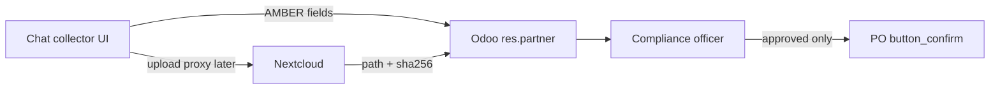

# Supplier Onboarding Chat Collector

**Status:** Draft design (Phase 0 knowledge + UX; no runtime)  
**Date:** 2026-08-13  
**Owner:** Sattva Brokers OpCo (process); IPCo (portal UX and later code)  
**Repo:** `trilok-ventures/sattva-odoo-infra`  
**Companions:**  
- `docs/superpowers/specs/2026-08-13-sattva-brokers-system-fabric-design.md` (§3.2 gates, §5.3 vault, §6.1 onboarding)  
- `docs/superpowers/specs/2026-08-13-sattva-versioned-kb.md`  
- `docs/superpowers/specs/2026-08-14-integrated-system-architecture.md` (Phase 2 GREEN edge / middleware portal)

This document is the operating spec for **how a foreign manufacturer becomes a purchasable supplier**. It consolidates the fragmented HR/policy pages into one How-To, maps every field and file to Odoo + Nextcloud, and defines a **scripted chat collector** as the human interface. Git wins if the Notion twin or Figma file drifts.

Notion twin (created after this spec): Knowledge Base → SOPs → *Supplier onboarding (chat collector)*.  
Figma: [Sattva Supplier Onboarding Chat](https://www.figma.com/design/gv62Ar5Zngd62TxS323GVp) (file created 2026-08-13; canvas empty — Starter MCP quota blocked `use_figma`). Reviewable screens: `docs/superpowers/mocks/supplier-onboarding-chat.html`. Capture that gallery into the Figma file when quota resets.

---

## 1. Purpose

Sattva cannot confirm a purchase order until `res.partner.supplier_pcp_status = approved`. Today the addon enforces that gate, but there is no guided path for a supplier (or procurement) to assemble the CFIA-aligned pack. Policy lives in four Notion trees; the versioned SOP row is two sentences.

**Done when**

1. One operational How-To lists every document and field required to leave `pending` and enter `review`.
2. The collector is a **scripted chat** (one turn = one field or one document type), not a freeform LLM and not Odoo chatter.
3. Files land only in Nextcloud. Chat and Notion store pointers, filename, SHA-256, and GREEN flags.
4. Conditional / probationary suppliers stay `review`. PO confirm remains blocked until `approved`.
5. A compliance officer — not the chat, not sales — is the only actor who may set `approved` or `blocked`.

**Success criteria (investor / CFIA story)**

- We never buy from an unvetted manufacturer.
- A CFIA document request can be answered from Odoo partner id → Nextcloud path in ≤24 hours (see CFIA runbook SOP).
- A supplier on a phone in India can finish KYC without being trained on Odoo.

---

## 2. Sources (do not duplicate as second policies)

| Role | Page | What we take |
| --- | --- | --- |
| Admin RACI | [Onboarding](https://app.notion.com/p/293e8d8c60c780d88a51c7410c4c18c9) | KYC, NDA, portal creds, ERP profile, initial audit |
| Special cases | [Supplier](https://app.notion.com/p/293e8d8c60c78062b284cb33e1ae1877) | Uncertified / other-broker / high-risk commodity / site change |
| Qualification policy | [Supplier Qualification and Approval](https://app.notion.com/p/293e8d8c60c780cb9534d0b9cb6dd53c) | Four stages; Approved / Conditionally Approved / Rejected; SQF-01 |
| PCP policy | [Food Safety & Preventive Control](https://app.notion.com/p/293e8d8c60c780ad8ecdce3ed3f0bcab) | PCP equivalency; SPC-01; FSP-01; 7-year retention |
| Ethics | [Supplier Code of Conduct](https://app.notion.com/p/293e8d8c60c780358ad8c3c9dad925f0) | SCD-01 |
| Index placeholder | [Supplier Management / Procurement](https://app.notion.com/p/263e8d8c60c7805e9bdbf0e11cefb021) | Named “Evaluation & Onboarding SOP” as text, not a page |
| KB stub | [Supplier qualification and approval SOP](https://app.notion.com/p/3bbe8d8c60c781c7be3dc5db39f52411) | Pointer only after this spec; do not overwrite |

Related SOPs (do not absorb): Lot and COA verification; CFIA document-request runbook.

---

## 3. Decision: scripted chat collector

| Option | Verdict |
| --- | --- |
| **A. Scripted guided chat** (chips + upload cards + dossier rail) | **Chosen.** Low literacy load, resumable, maps 1:1 to Odoo fields, no model on RED PDFs. |
| B. Freeform LLM that “extracts” a dossier from conversation | Rejected. Hallucinated compliance; RED in transcripts; fails CFIA. |
| C. Odoo chatter + attachments | Rejected. Files land in the wrong SoR; UX is not supplier-facing. |
| D. Long web form wizard only | Parked as a fallback layout. Chat is the primary metaphor; the dossier rail is the form. |

The chat is a **GREEN/AMBER UI** on the Phase 2 Vercel / middleware portal. It is not a second CRM. Runtime wiring (Keycloak supplier persona, n8n WebDAV upload) waits for an approved Phase 2 plan. This spec + Notion + Figma are Phase 0.

---

## 4. Status mapping (YAGNI — no fifth Odoo value)

| Process language (policy) | `supplier_pcp_status` | PO confirm |
| --- | --- | --- |
| Intake / KYC incomplete | `pending` | Blocked |
| Pack in vault, under review, **or** “conditionally approved” / 3-month probation | `review` | Blocked |
| ASL after Compliance Officer sign-off | `approved` | Allowed |
| Rejected, expired cert, CAPA overdue, fraud, falsified docs | `blocked` | Blocked |

`risk_band` defaults to `medium`. Uncertified or chili/turmeric → `high` until an officer lowers it. `haccp_certified` / `brc_certified` are set from the cert-type chip plus a valid expiry, not from OCR in this pass.

---

## 5. Systems of record

| Domain | SoR | Chat may |
| --- | --- | --- |
| Partner master, PCP status, risk, cert flags, vault path | Odoo | Write AMBER fields; never set `approved` |
| Certificates, legal PDFs, PCP pack | Nextcloud | Upload via future middleware; show filename + hash + path |
| Process wiki | This spec + Notion SOP | Humans only; `agent_ok` off while Draft/AMBER |
| Per-lot CoA | Nextcloud `/Clients/.../COA` | Out of this chat (Lot SOP) |

Vault paths (extends fabric §5.3):

- `/Suppliers/{name}/Certificates/` — GFSI/HACCP/BRC/FSSC/ISO certs
- `/Suppliers/{name}/Legal/` — registration, export license, NDA, SCD-01, FSP-01
- `/Suppliers/{name}/PCP/` — HACCP/PCP summary, sanitation, pest, training, recall drill
- Existing `/PCP/Supplier_Audits/` — officer-side audit reports (not supplier-uploaded)

`{name}` is the Odoo partner display name, sanitised. `nextcloud_folder_path` stores the supplier root. Phase 1 n8n provisions folders on vendor create (fabric §6.1). Until then, IT creates folders by hand.

---

## 6. Document and field inventory

Fictional example only: **Example Foods Pvt Ltd**. No real partners. No PDF bytes in this spec.

### 6.1 Identity (Odoo)

| Field | Required to leave `pending` | Notes |
| --- | --- | --- |
| Legal name | Yes | Maps to `res.partner.name` |
| Trade name | No | `ref` or comment |
| Registered address | Yes | Partner address |
| Plant / production address | Yes if different | Child contact or note |
| QA contact name, email, phone | Yes | Child contact, type QA |
| Commercial contact | No | Child contact |
| FSSAI number | Yes (India) | Custom char later; Phase 0 = partner comment / forthcoming field |
| IEC number | Yes if exporting | Same |
| GSTIN | No | Same |

Phase 0 does **not** add Odoo columns. The spec names the contract. Implementation plan later may add `x_fssai`, `x_iec` or a `sattva.supplier.profile` model. Until then officers record numbers in partner notes — still AMBER, still not Notion.

### 6.2 Legal uploads (Nextcloud `/Legal/`)

| File | Required | Form id |
| --- | --- | --- |
| Business registration / CIN | Yes | — |
| Export license | If applicable | — |
| Signed NDA / brokerage agreement | Yes | Confidentiality policy |
| Code of Conduct declaration | Yes | SCD-01 |
| Food safety declaration | Yes | FSP-01 |

### 6.3 Food-safety uploads

| File | Folder | Required |
| --- | --- | --- |
| GFSI or HACCP certificate (not expired) | `/Certificates/` | Yes **or** uncertified branch |
| PCP / HACCP plan summary | `/PCP/` | Yes |
| Sanitation SOPs | `/PCP/` | Yes |
| Pest control evidence | `/PCP/` | Yes |
| Personnel training matrix | `/PCP/` | Yes |
| Recall / traceability drill | `/PCP/` | Yes |

Uncertified branch: still collect the PCP pack; set `risk_band = high`; stay `review`; mandatory third-party audit before `approved`. Limited probation is **not** PO rights.

### 6.4 Commercial (Odoo)

Intended SKUs (onion / garlic / allied dehydrated), MOQ, lead time, Incoterms preference, `risk_band`, high-risk commodity flag (chili, turmeric → extra aflatoxin/pesticide testing on lots; CoAs still Lot SOP).

### 6.5 Explicitly not in this chat

Per-lot CoA, phytosanitary, BL/AWB, Stage 4 audit scheduling, live prices, bank details, passports. RED identity documents beyond business registration are refused; point the user to email compliance, do not accept in chat.

---

## 7. Conversation script

Each turn writes one Odoo field or one vault object. Resume via magic link keyed to `res.partner` id (Phase 2). Copy is calm importer English.

| Turn | Bot prompt (summary) | Capture | Screen |
| --- | --- | --- | --- |
| 1 | Welcome, ~20 min, save/resume, what we will collect | Language chip EN (HI later) | 01 Welcome |
| 2 | Legal company name | `name` | 02 Identity |
| 3 | Registered vs plant address | Addresses | 02 |
| 4 | QA contact | Child contact | 02 |
| 5 | Cert scheme chips: BRC / FSSC 22000 / ISO 22000 / HACCP-only / none | Flags + branch | 03 Certification |
| 6 | Upload current certificate + expiry | File + date | 04 Upload |
| 7 | FSSAI and IEC numbers | Text | 05 Numbers |
| 8 | Upload registration and export license | Files | 06 Legal |
| 9 | Products chips + MOQ + lead time | Commercial | 07 Products |
| 10 | High-risk commodity? Extra testing notice | `risk_band` | 07 |
| 11 | PCP pack: five slots, ticks in dossier | Files | 08 PCP pack |
| 12 | Upload signed NDA, SCD-01, FSP-01 | Files | 09 Agreements |
| 13 | GREEN/AMBER review list (no PDF preview) | Confirm | 10 Review |
| 14 | Submit | `pending`→`review` if required set complete; else stay `pending` with missing list | 11 Submitted |
| 15 | Need more docs (officer request) | Resume at missing slots | 12 Need more |

**Internal (not supplier chat)**

| Screen | Actor | Action |
| --- | --- | --- |
| C1 Review queue | Compliance | List `review` / incomplete `pending` with missing-doc chips |
| C2 Dossier decide | Compliance | Request more / Block / Approve — Approve labelled as an Odoo action |

Required set to enter `review`: legal name, both addresses, QA contact, FSSAI, at least one legal registration file, PCP pack five files **or** explicit uncertified attestation plus PCP pack, CoC + FSP-01. Certificate file required unless uncertified branch.

E-sign vendor (DocuSign etc.) is Phase 3. Phase 0/2: upload signed PDF.

---

## 8. Figma screen inventory

File: **Sattva Supplier Onboarding Chat** — https://www.figma.com/design/gv62Ar5Zngd62TxS323GVp  
HTML gallery (source of truth for layout until Figma is filled): `docs/superpowers/mocks/supplier-onboarding-chat.html`

Desktop 1440: chat column (~60%) + dossier rail (~40%). Mobile 390: chat full-bleed; dossier as a bottom sheet.

**Figma blocker:** authenticated seat is View on Starter (`team::1669487108376139932`). `create_new_file` succeeded; `search_design_system` / `use_figma` / `generate_figma_design` returned the Starter monthly MCP cap. Do not retry until the quota resets or the seat is Full/Dev.

**Desktop:** 01 Welcome, 02 Identity, 03 Certification choice, 04 Certificate upload, 05 Registration numbers, 06 Legal uploads, 07 Products / MOQ / lead time, 08 PCP pack checklist, 09 Agreements, 10 Review and submit, 11 Submitted pending review, 12 Need more docs.

**Mobile:** M1 Welcome, M2 Upload, M3 Checklist sheet, M4 Submitted.

**Compliance:** C1 Review queue, C2 Dossier decide.

**Components:** bot bubble, supplier bubble, chip row, upload card (filename, size, hash stub, vault path — **no lab-page preview**), dossier row (missing / uploaded / verified), status pill (`pending` / `review` / `approved` / `blocked`).

Visual: sand canvas `#F7F4EF`, ink `#1C1917`, forest accent `#1F4D3A`, amber warning, rose blocked. Type: Inter. Progress “n of 12”. No consumer-bot slang.

---

## 9. Roles

| Actor | May | Must not |
| --- | --- | --- |
| Supplier (portal persona, Phase 2) | Answer turns, upload to own folder | Set PCP status; see other suppliers; download others’ RED |
| Procurement / sales | Create vendor `pending`; open chat on their behalf | Confirm PO; set `approved` |
| Compliance officer | Set `review` / `approved` / `blocked`; request more docs | Skip vault evidence |
| IT | Provision folders, portal access (manual until Phase 1) | Approve food safety |
| Agents | Read GREEN Published only | Write AMBER SOP; OCR vault PDFs; set Odoo status |

---

## 10. Special cases

1. **No certification:** chip `none` → copy that a third-party audit is mandatory; collect PCP pack; `risk_band = high`; remain `review` after submit; no PO.
2. **Existing exporter under another broker:** GFSI cert valid → skip Stage 4 audit unless high-risk; still `review` until first-lot CoA (Lot SOP).
3. **High-risk commodity (chili, turmeric):** extra testing notice in turn 10; does not add CoA upload here.
4. **Ownership or site change:** reset to `review`; re-run turns 5–12; prior `approved` is revoked until officer re-approves.

---

## 11. Verification and troubleshooting

**Verification (human)**

- Required files exist at the vault paths on the partner.
- Hashes stored on the partner or a forthcoming attachment model.
- Status is `review` only after the required set is complete.
- A test PO against `pending` / `review` / `blocked` still raises Compliance Gate Blocked; `approved` confirms.

**Troubleshooting**

| Symptom | Action |
| --- | --- |
| Supplier stuck on upload | Check folder exists; IT creates path; do not accept email PDFs into Notion |
| Expired cert submitted | Keep `pending` or `review`; dossier row `expired`; request more |
| Chat asks to paste CoA numbers from a PDF | Refuse; CoA is Lot SOP; this chat is onboarding only |
| Officer wants “conditional PO” | Refuse; use `review` + RFQ draft only |

---

## 12. Out of scope (this spec)

Odoo form XML, new Python fields, n8n folder provision, Keycloak, WhatsApp Business, DocuSign, Hugging Face on PDFs, HubSpot, dual-portal application code, editing Published KB library pages, LifeOS.

Phase 1 (separate plan): partner form shows PCP fields; vendor create provisions Nextcloud folders.  
Phase 2 (separate plan): this chat on Vercel/middleware, uploads proxied, browser never talks to Nextcloud.

---

## 13. Promotion

1. Merge this file. Record SHA on the Notion SOP Catalog relation when a Version Catalog row exists.
2. Notion SOP stays **Draft / AMBER / agent_ok off** until a compliance human sets In Review then Published.
3. GREEN Content inbox holds a digest of turns (no partner names). Human promotes after `red_scan = clear`.
4. Do not edit the Notion twin to contradict this file. If they disagree, git wins; set Drift on the catalog row.
