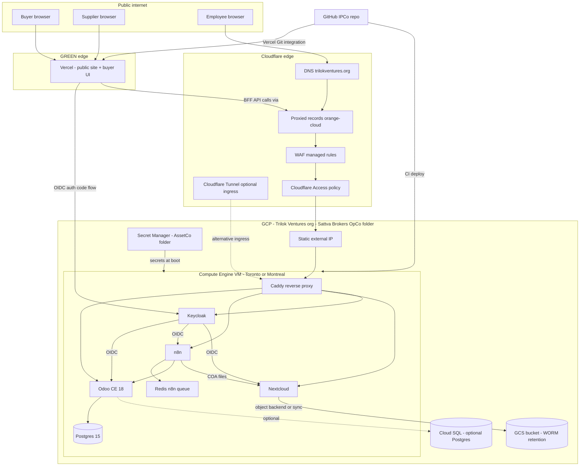
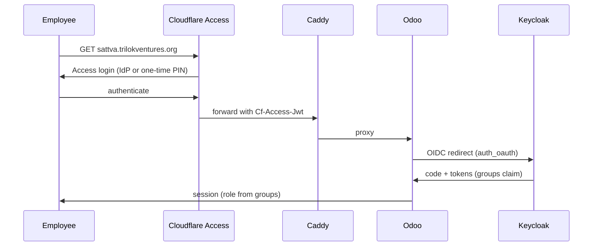

# Integrated System Architecture — Trilok Ventures / Sattva Brokers

**Status:** Proposed (Phase 1–3 implementation spec; extends the locked Phase 0 fabric)
**Date:** 2026-08-14
**Owner:** IPCo (software); AssetCo (production infrastructure); Sattva Brokers OpCo (operations)
**Repo:** `trilok-ventures/sattva-odoo-infra`
**Companion specs:** `2026-08-13-sattva-brokers-system-fabric-design.md` (locked), `2026-08-13-sattva-versioned-kb.md` (locked)
**Inputs reconciled:** `deploy/prod/` Caddy blueprint (branch `cursor/prod-deploy-blueprint-9921`), `deploy/cloudflare-tunnel/` runbook (branch `cursor/cf-tunnel-runbook-9921`), `deploy/dns/security-checklist.md` (branch `cursor/dns-workspace-security-9921`), Notion "GCP · CF · Notion Ops Dashboard Brainstorm" (2026-08-13)

This document is the implementation-grade architecture for the integrated stack: **Nextcloud, Odoo CE, n8n, and Keycloak on GCP, proxied via Cloudflare, pointed at the GCP-deployed application IP, with this GitHub repository as the source of truth.** It does not supersede the locked fabric spec; it operationalizes it. Where any statement here conflicts with the locked fabric (one SoR per domain, RED/GREEN split, stop list), the locked fabric wins.

---

## 1. Scope and phase gating

| Phase | What exists | This spec contributes |
| --- | --- | --- |
| Phase 0 (locked) | Fabric spec, versioned KB spec, Notion twins | — |
| Phase 1 (this spec's first target) | Local Compose: Odoo 18 + Postgres 15 | Add n8n, Nextcloud, Redis; repo layout; CI contracts |
| Phase 2 | — | GREEN edge: Vercel site + middleware portal + Figma-driven UX |
| Phase 3 | — | GCP production runtime, Keycloak IdP, Cloudflare edge, WORM vault |

**Gate discipline:** no phase's infrastructure may be deployed before its predecessor's acceptance criteria pass (fabric spec §8). Compose-on-VM precedes GKE; GKE/Cloud Armor/PKI wait for a live CFIA audit or enterprise buyer.

---

## 2. Target production topology (Phase 3)



**Hostnames (single domain, path- or subdomain-separated):**

| Hostname | Service | Exposure |
| --- | --- | --- |
| `trilokventures.org`, `www.` | Vercel public site | Public |
| `sattva.trilokventures.org` | Odoo CE | Cloudflare Access: employees only |
| `vault.trilokventures.org` | Nextcloud | Cloudflare Access: employees only |
| `n8n.trilokventures.org` | n8n editor | Cloudflare Access: IT only |
| `auth.trilokventures.org` | Keycloak | Public (login endpoints), Access-protected admin console |
| `app.trilokventures.org` | Middleware portal (Phase 2) | Public login, role-gated content |

Rationale for Cloudflare Access in front of everything employee-facing: it is the cheapest zero-trust gate that works before Keycloak realm hardening is complete, and it satisfies the DNS security checklist's requirement that the Odoo database manager and login form never be raw internet-facing.

---

## 3. This repository as source of truth

Git is the only place where infrastructure, workflow, and compliance-gate definitions are versioned. Runtime UIs (n8n editor, Keycloak admin, Nextcloud admin) are **never** the canonical store.

### 3.1 Repository layout (target)

```
sattva-odoo-infra/
├── addons/
│   └── sattva_compliance/          # existing PCP gate
├── config/
│   └── odoo.conf                   # local dev only (known-broken for prod; see AGENTS.md)
├── deploy/
│   ├── local/                      # docker-compose.yml lives at repo root today; Phase 1 extends it
│   ├── prod/
│   │   ├── Caddyfile               # from cursor/prod-deploy-blueprint-9921
│   │   ├── odoo.conf               # hardened template, env-substituted
│   │   ├── docker-compose.prod.yml # to be written in Phase 3 plan
│   │   └── .env.example
│   ├── cloudflare-tunnel/
│   │   ├── config.yml              # from cursor/cf-tunnel-runbook-9921
│   │   └── run-tunnel.sh
│   ├── dns/
│   │   └── security-checklist.md   # from cursor/dns-workspace-security-9921
│   ├── keycloak/
│   │   ├── realm-trilok.json       # exported realm, secrets stripped
│   │   └── README.md
│   └── gcp/
│       ├── README.md               # VM bootstrap, firewall, IP reservation steps
│       └── terraform/              # optional; only if manual console steps prove error-prone
├── n8n/
│   └── workflows/                  # exported workflow JSON; UI edits forbidden in prod
│       └── README.md
├── middleware/                     # Phase 2 (Workstream 2)
├── web/                            # Phase 2–3 (Workstream 3)
├── docs/
│   └── superpowers/
│       ├── specs/                  # locked + proposed specs (this file)
│       └── plans/                  # implementation plans per phase
├── .cursor/agents/                 # project subagents (fabric-architect et al.)
├── docker-compose.yml              # local dev stack (Odoo + Postgres)
├── docker-compose.override.yml     # local dev workarounds
└── AGENTS.md
```

### 3.2 Promotion contract

1. All changes land via PR on a `cursor/*` or feature branch; `main` is protected.
2. Specs in `docs/superpowers/specs/` are append-only once marked **Locked**; changes require a new dated spec that supersedes.
3. n8n workflows are edited in a staging n8n, exported to `n8n/workflows/*.json`, reviewed in PR, and imported to production by CI or runbook — never edited live.
4. Keycloak realm changes follow the same pattern: staging realm → export → PR → import.
5. Secrets never enter git. Local uses `.env` (git-ignored); production uses GCP Secret Manager mounted at boot.

---

## 4. Component architecture

### 4.1 Odoo CE 18 (operational SoR)

- Local: existing `docker-compose.yml` (web + db). Untouched by this spec.
- Production: container on the GCP VM behind Caddy, `proxy_mode = True`, `list_db = False`, `dbfilter = ^sattva$`, strong `admin_passwd` from Secret Manager, `/web/database/*` blocked at Caddy. (All per `deploy/dns/security-checklist.md` and `deploy/prod/odoo.conf`.)
- Port 8069 binds to `127.0.0.1` or the internal docker network only. With Tunnel ingress, no public port mapping at all.
- Phase 1 additions per fabric spec §5.1: provision Nextcloud folder on vendor create; role groups `sales.exec`, `compliance.officer`, `finance.manager`, `logistics.exec`; lot/quarantine model.

### 4.2 Postgres

- Phase 1 local: `postgres:15` container (exists).
- Phase 3 production **decision point**: self-hosted Postgres 15 on the VM with nightly encrypted backups to GCS (default, cheapest, adequate at current scale) vs Cloud SQL (managed, ~3× cost, automatic PITR). Decision recorded in §9; default is self-hosted with a documented restore drill. Migration to Cloud SQL is a non-event later because Odoo only needs `db_host` changed.

### 4.3 n8n (integration bus)

- Phase 1 local: add `n8n` + `redis` services to compose. Redis is n8n's queue backend (`EXECUTIONS_MODE=queue` when workers are added), not a second SoR.
- Production: same VM, behind Caddy at `n8n.trilokventures.org`, Cloudflare Access policy restricting to IT group.
- Credentials live in n8n's encrypted store (encryption key from Secret Manager). Workflow JSON exports commit to `n8n/workflows/`.
- Hard rule from fabric spec: n8n may move RED files into Nextcloud but must not persist RED payloads in execution logs — workflows must be built with "Save Data on Error/Success" disabled for RED-touching nodes.

### 4.4 Nextcloud (RED vault)

- Phase 1 local: add `nextcloud` service (apache image) with a named volume; folder convention per fabric spec §5.3 (`/PCP/...`, `/Clients/...`, `/Suppliers/...`).
- Production: same VM, `vault.trilokventures.org`, Cloudflare Access employees-only. Files on the VM disk in Phase 3a; GCS WORM bucket as external storage / sync target in Phase 3b when the 7-year retention requirement meets its first audit. No public share links for RED (enforced via Nextcloud config: `shareapi_allow_public_upload` off, share expiration defaults).
- Browser clients never hold vault credentials: the middleware portal (Workstream 2) proxies uploads server-side via WebDAV with a service account.

### 4.5 Keycloak (IdP)

- **Why Keycloak and not IAP-only:** IAP is excellent for GCP-hosted employee apps but does not issue tokens a Vercel-hosted public site can use for buyer/supplier sign-up, self-service password reset, and social/brokered login. Keycloak covers employees, buyers, and suppliers with one realm and per-client policies; Cloudflare Access remains as the network-layer gate for employee-only hostnames. This resolves the fabric spec §6.5 "IAP + Keycloak/OIDC" line into a concrete split: **Access for network gating, Keycloak for identity.**
- Realm `trilok`; clients:
  - `middleware-portal` (public client, auth-code + PKCE)
  - `web-public` (public client, auth-code + PKCE; used only for sign-in then routes to portal)
  - `odoo` (confidential; OIDC auth via the `auth_oauth` module)
  - `nextcloud` (confidential; OIDC app)
  - `n8n` (confidential; OIDC)
- Groups map 1:1 to fabric roles: `sales.exec`, `compliance.officer`, `finance.manager`, `logistics.exec`, `it.admin`, plus portal personas `buyer`, `supplier`. Odoo role groups synchronize from Keycloak groups via the OIDC module's group claim in Phase 3; Phase 1 keeps Odoo-local groups.
- Realm export lives at `deploy/keycloak/realm-trilok.json` (secrets stripped). Staging edits → export → PR → import.
- `auth.trilokventures.org`: login/user-facing endpoints public; `/admin` path blocked at Caddy except via Cloudflare Access.

### 4.6 Caddy (edge of the VM)

- The existing `deploy/prod/Caddyfile` pattern (Cloudflare Origin Certificate, Full-strict, websocket routing for Odoo's 8072, security headers, 100MB body limit for COA uploads) extends with vhost blocks for `vault.`, `n8n.`, and `auth.` hostnames. One Caddy process, one container, four site blocks.
- Cloudflare SSL mode must be **Full (strict)**; Flexible causes redirect loops (documented in the Caddyfile header comments).

### 4.7 Cloudflare

- DNS + proxy for all `trilokventures.org` records.
- **Ingress choice:** proxied A-record to the VM static IP with Caddy + Origin Cert (default, matches the prod blueprint) *or* Cloudflare Tunnel (`deploy/cloudflare-tunnel/`) when the VM must not listen on 80/443 at all. Both are documented and kept working; the repo defaults to the A-record path because it is simpler to reason about and the tunnel runbook exists as a proven fallback.
- Access policies: employees-only for `sattva.`, `vault.`, `n8n.`, and `auth./admin`. Service tokens for CI health checks.
- WAF managed rules on; rate limiting on `/web/login` and Keycloak token endpoints.

### 4.8 GCP

- Org: Trilok Ventures → folder: Sattva Brokers OpCo. AssetCo folder holds Secret Manager and (later) KMS/WORM bucket, licensed into OpCo.
- Compute: single e2-standard-2 (2 vCPU / 8GB) in `northamerica-northeast1` (Toronto) or `northamerica-northeast2` (Montreal) — Canadian residency, per the Ops Dashboard brainstorm's pragmatism note. Reserved static external IP. Ubuntu 24.04 LTS, Docker + compose plugin installed via startup script from this repo (`deploy/gcp/README.md`).
- Firewall: default-deny inbound; allow 80/443 from Cloudflare IP ranges only (published list, scripted); SSH via IAP TCP forwarding only (no public 22).
- Backups: nightly `pg_dump` + Nextcloud data tarball to a GCS bucket with 30-day versioning; quarterly restore drill documented in `deploy/gcp/README.md`.
- Deferred until audit/buyer requires: GKE, Cloud Armor, Cloud DLP pipeline to Vertex AI, Vault PKI, Wazuh/SIEM (fabric spec §3.6 stop list).

---

## 5. Identity and access flows

### 5.1 Employee signs into Odoo (Phase 3)



Phase 1 keeps Odoo-local users; the flow above activates in Phase 3 when Keycloak is deployed. Employee offboarding = disable in Keycloak + remove from Cloudflare Access group.

### 5.2 Buyer / supplier sign-in (Phase 2–3)

Public site (`web/`, Vercel) → "Sign in" → Keycloak auth-code + PKCE → middleware portal session → portal calls Odoo/n8n/Nextcloud **server-side** with a service account, filtering to that persona's records. Browsers never receive Odoo, n8n, or Nextcloud credentials, and never reach Nextcloud directly (fabric spec §5.6).

### 5.3 Service-to-service

- n8n → Odoo: Odoo API key on a dedicated `n8n.fabric` user (least privilege: read/write only the models the COA workflow touches).
- n8n → Nextcloud: WebDAV app-password service account scoped to the PCP/Clients/Suppliers trees.
- Middleware → fabric: same pattern, distinct accounts per direction for audit clarity.
- All secrets from GCP Secret Manager in production; `.env` locally.

---

## 6. Data classification enforcement points

| Boundary | Enforcement |
| --- | --- |
| Browser → Nextcloud | None direct. Middleware proxies; Cloudflare Access gates the vault hostname anyway. |
| n8n execution logs | RED-touching nodes run with data-saving disabled; workflow review checklist in `n8n/workflows/README.md`. |
| Vercel site/portal | Receives GREEN fields only (moisture %, mesh pass rate, pass/fail, hashed COA refs). API contract tests in `middleware/` assert no RED keys in responses (Phase 2 acceptance). |
| Hugging Face / Tavily / Vertex | GREEN extracts only; n8n drops calls containing RED markers and logs a classification violation (metadata only). |
| GitHub | No secrets; gitleaks (or equivalent) in CI on every PR. |

---

## 7. Local development (Phase 1 target state)

`docker-compose.yml` gains three services — `n8n` (with `redis`), `nextcloud` — alongside the existing `web` + `db`. The committed broken `config/odoo.conf` stays untouched (the override-file workaround documented in AGENTS.md remains the mechanism). Acceptance for Phase 1 is the fabric spec §8 list, unchanged: PO gate behavior, Nextcloud folder provisioning on vendor create, COA workflow pass/fail fixtures, GREEN-only n8n logs.

The Phase 1 implementation plan (compose diffs, addon changes for folder provisioning, the COA workflow JSON) is a separate document: `docs/superpowers/plans/2026-08-14-phase-1-local-fabric.md` — **not** written yet; scheduled next.

---

## 8. Environments matrix

| Concern | Local (Phase 1) | Production (Phase 3) |
| --- | --- | --- |
| Host | Docker Compose on dev machine/VM | GCP Compute Engine, Toronto/Montreal |
| Ingress | `localhost:8069` (+ n8n/Nextcloud ports) | Cloudflare proxy → static IP → Caddy |
| TLS | none | Cloudflare Origin Cert (Full strict) |
| Identity | Odoo-local users | Keycloak realm `trilok` + Cloudflare Access |
| Secrets | `.env` (git-ignored) | GCP Secret Manager |
| Postgres | container | container w/ GCS backups (Cloud SQL optional) |
| Vault storage | named volume | VM disk → GCS WORM (3b) |
| n8n edits | local UI allowed, exported to git | staging only; prod imports from git |

---

## 9. Decision register (deltas to the locked fabric)

| # | Decision | Choice | Alternatives | Rationale |
| --- | --- | --- | --- | --- |
| D1 | Production ingress | Cloudflare proxied A-record → VM static IP → Caddy w/ Origin Cert | Cloudflare Tunnel (kept as proven fallback); direct + Let's Encrypt DNS-01 | Matches existing prod blueprint; simplest mental model; no origin lock-in |
| D2 | Identity provider | Keycloak (all personas) + Cloudflare Access (employee hostnames) | IAP-only; Auth0/Clerk | IAP cannot serve public buyer/supplier sign-in; SaaS IdPs add per-MAU cost against the stop list |
| D3 | Production Postgres | Self-hosted container + GCS backups | Cloud SQL | Cost; scale doesn't justify managed service yet; migration path documented |
| D4 | Compute | Single VM (Compose) in Canada | GKE; Cloud Run | Fabric spec defers GKE; Compose-on-VM is the brainstorm's pragmatic call; Cloud Run poor fit for stateful Nextcloud/Odoo workers |
| D5 | Realm management | Exported realm JSON in git, staging→prod promotion | Manual admin console drift | Source-of-truth rule (§3.2) |
| D6 | Supabase (authenticated in this environment) | **Unassigned** — no fabric role | As middleware session store; as buyer-portal DB | Fabric rule: one SoR per domain, and Odoo already covers every domain Supabase would touch. Recorded so the decision is explicit, not accidental. Revisit only if a new domain (e.g. realtime notifications) emerges that Odoo cannot hold. |

---

## 10. Traceability

| Requirement | Source | Where addressed |
| --- | --- | --- |
| Cloudflare-proxied GCP deployment | User directive 2026-08-13 | §2, §4.6–4.8 |
| GitHub repo = source of truth | User directive; fabric §3.1 | §3 |
| Keycloak identity for all personas | User directive; fabric §6.5 | §4.5, §5 |
| n8n as only bus | Locked fabric | §4.3 |
| Nextcloud RED vault, WORM path | Locked fabric; retention rule | §4.4 |
| No GKE/Armor/PKI before audit | Fabric §3.6; Ops brainstorm | §4.8 deferred list |
| DB-manager/login hardening | DNS security checklist | §4.1, §4.6 |
| Compose-on-VM in Canada first | Ops brainstorm | §4.8 |
| Supabase disposition | User note 2026-08-13 | §9 D6 |

---

## 11. Acceptance (spec-level)

1. A reader can produce the production environment from this repo plus Secret Manager values alone.
2. Every hostname in §2 has an ingress path, a TLS story, and an access policy.
3. Every fabric component has exactly one SoR assignment and one identity path.
4. No section contradicts the locked fabric spec; conflicts resolve toward the fabric.
5. Phase 1 plan can be written from §7 without further architecture decisions.
