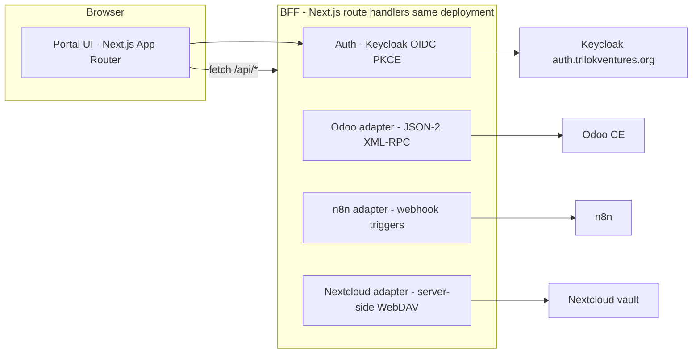

# Sattva Middleware Portal — UX Design

**Status:** Proposed (Phase 1–2)
**Date:** 2026-08-14
**Owner:** IPCo
**Depends on:** `2026-08-13-sattva-brokers-system-fabric-design.md` (locked), `2026-08-14-integrated-system-architecture.md`
**Figma reference:** _Sattva Middleware_ file (link added after Workstream 2 Figma pass)

This spec defines the **middleware portal**: the single authenticated web surface between people and the Sattva fabric. It is the "MW" role router in the Ops Dashboard brainstorm. It holds **no business state** — every read and write passes through to Odoo (operational SoR), n8n (integration bus), or Nextcloud (RED vault, server-side only).

---

## 1. What the middleware is and is not

| Is | Is not |
| --- | --- |
| A Next.js (App Router) BFF portal | A CRM, document store, or reporting database |
| The only browser-facing door to the fabric | A replacement for the Odoo back office (employees may still use Odoo directly) |
| Authenticated by Keycloak OIDC | A credential holder — browsers never see Odoo/n8n/Nextcloud secrets |
| Persona- and role-filtered | A second pipeline for anything |

**Why a portal instead of exposing Odoo to buyers/suppliers:** Odoo CE portal users are coarse-grained and expose the AMBER back-office surface. The fabric spec (§5.6) requires buyers to see GREEN lot status only and browsers to never talk to Nextcloud. A thin BFF gives exact field-level control over what leaves the fabric.

**Why Next.js on Vercel:** the locked fabric assigns the GREEN edge to Vercel (§5.6), and the same team already owns the marketing site (Workstream 3). The portal deploys as a separate Vercel project (`app.trilokventures.org`) so marketing deploys cannot break portal sessions.

## 2. Architecture

**Rules:**
- All fabric calls happen in route handlers / server actions. No fabric URL or credential is ever serialized to the client.
- The portal session (encrypted cookie) carries: Keycloak subject, role groups, persona. Role → data filtering happens in the BFF, not the UI.
- Service accounts: `svc.portal.odoo` (Odoo), `svc.portal.nc` (Nextcloud), `svc.portal.n8n` (webhook auth). Per integrated-architecture §5.3, distinct accounts per direction for audit clarity.
- Responses are contract-tested to contain **no RED keys** (file bytes, vault paths to buyers, PII) per persona.

## 3. Personas and role mapping

| Persona | Keycloak groups | Sees | Cannot |
| --- | --- | --- | --- |
| Sales exec | `sales.exec` | Own pipeline, partners, quotes; compliance status badges | Approve suppliers; see vault files |
| Compliance officer | `compliance.officer` | Review queue, PCP evidence status, CAPA list, lot verification results | Modify price lists |
| Finance manager | `finance.manager` | Invoices, payment status, commission reports | Supplier approval; PO creation |
| Logistics exec | `logistics.exec` | Shipments, CFIA clearance status, delivery windows | Financial terms |
| Buyer | `buyer` | Own orders' GREEN lot status, quotes, contracts | Any other buyer; any RED file; supplier identity beyond display name |
| Supplier | `supplier` | Own PCP status, upload documents, CAPA responses | Any other supplier; Odoo |
| IT admin | `it.admin` | Health dashboard (n8n queue, webhook status), user list | Business records |

Employee roles are cumulative only where the fabric's separation-of-duties rules (§3.4) allow; the BFF enforces the strictest reading (e.g., a user holding both `sales.exec` and `finance.manager` still cannot self-approve payment on a PO they created).

## 4. Screen inventory

State conventions apply to every screen: **loading** (skeleton), **empty** (illustration + one-line guidance + primary action), **error** (message + retry + support link), **offline** (banner, read-only). All timestamps render in the user's locale with an explicit timezone label (America/Toronto default).

### 4.1 Shared

| # | Screen | Purpose | Key elements |
| --- | --- | --- | --- |
| S1 | Sign-in | Keycloak handoff | "Sign in with Trilok ID" button; no local password field; error state for denied access |
| S2 | Role router | Post-login landing decision | Redirects by primary group; employees → dashboard, buyer → orders, supplier → documents |
| S3 | Notifications | Fabric event feed | GREEN/AMBER events from n8n webhooks: `vendor.pcp_status_changed`, `lot.coa_verified`, `po.blocked`, `invoice.posted` (per brainstorm webhook catalog — never file bytes) |
| S4 | Profile | Session + role visibility | Name, persona, groups, sign-out; no self-service role edits |

### 4.2 Employees (role-filtered ops dashboard)

| # | Screen | Persona | Purpose | Key elements |
| --- | --- | --- | --- | --- |
| E1 | Ops dashboard | all employees | Today at a glance | KPI cards (open POs, pending compliance reviews, lots in quarantine, unpaid invoices), activity feed, quick links into Odoo for deep work |
| E2 | Compliance review queue | `compliance.officer` | Suppliers awaiting PCP review | Table: supplier, status (`pending`/`review`), evidence completeness (from `nextcloud_folder_path` listing), age. Actions: **Start review**, **Approve**, **Block** (with reason modal) |
| E3 | Supplier detail | `compliance.officer`, `sales.exec` (read-only) | One supplier's compliance posture | PCP status timeline, certificate list (names + expiry, no file downloads for sales), HACCP/BRC flags, risk band, linked CAPAs |
| E4 | PO gate console | `sales.exec` | Confirm POs with compliance gate surfaced | PO list with per-row gate status; confirm action calls Odoo `button_confirm`; the compliance-gate `UserError` renders as an inline dialog ("Compliance Gate Blocked — supplier not approved") with a link to E3. **The gate is never bypassable in the portal.** |
| E5 | Lot verification board | `compliance.officer`, `logistics.exec` | COA verification pipeline | Kanban: Quarantine → Verifying → Available / CAPA. Cards show GREEN metrics (moisture %, mesh pass rate) + COA hash; the PDF itself is a "request access" action (audit-logged), never a download |
| E6 | Invoice console | `finance.manager` | Commission invoices and payments | Table + filters; "post" actions proxy to Odoo; AMBER amounts visible only to finance |
| E7 | Health dashboard | `it.admin` | Fabric health | n8n queue depth, recent webhook failures, Odoo/Nextcloud reachability, last workflow run per workflow |

### 4.3 Buyers

| # | Screen | Purpose | Key elements |
| --- | --- | --- | --- |
| B1 | Orders overview | Buyer home | Their orders as cards: product, quantity, lot status (GREEN pass/fail/pending), expected ship window |
| B2 | Order detail | Traceability view | Timeline (contract → production → shipment → CFIA clear → delivered), GREEN lab metrics per lot, documents the compliance officer has explicitly released (PUBLIC/GREEN only) |
| B3 | Quotes & contracts | Commercial documents | Quote list, accept action (writes to Odoo), contract PDF download (buyer's own documents only) |

### 4.4 Suppliers

| # | Screen | Purpose | Key elements |
| --- | --- | --- | --- |
| P1 | Supplier home | Status at a glance | PCP status banner (pending/review/approved/blocked + what-to-do-next), outstanding CAPAs, document checklist progress |
| P2 | Document upload | Evidence submission | Drag-drop upload per required document type (HACCP cert, BRC cert, COA, sanitation records); files stream server-side via WebDAV to the supplier's `nextcloud_folder_path`; the browser never receives a vault URL or credential. Progress, virus-scan pending state, success hash |
| P3 | CAPA responses | Corrective actions | Open CAPAs assigned to them, response form (text + attachments → Nextcloud), submission writes back to Odoo via n8n |

## 5. Compliance-gate UX contract

The PO confirm gate (fabric §3.2) must feel like guidance, not a dead end:

1. **Before the action:** E4 shows the gate state on each PO row (green "Approved supplier", amber "Review in progress", red "Blocked/Pending").
2. **On a blocked confirm:** inline dialog, not a toast: supplier name, current status, the missing evidence categories, and a deep link to E3. Copy pattern: "PO P00042 cannot be confirmed — Maple Ridge Organics is **Pending PCP review**. Missing: HACCP certificate, sanitation audit. [View supplier compliance]"
3. **Never:** a "Confirm anyway" affordance, for any role, in any state.

## 6. Design language

- **Toolchain:** Tailwind + shadcn/ui (aligned with the Vercel stack; matches Workstream 3 tokens).
- **Tone:** quiet operations tool. Dense tables, generous whitespace in forms, no marketing chrome inside the app.
- **Color semantics:** classification-aware — red accents only for RED/blocked states; amber for in-review; green for released/available. Never use color alone (icon + label).
- **Data-viz:** minimal; KPI numbers and sparklines only. Anything analytical belongs to BI's GREEN extracts, not the portal.
- **Accessibility:** WCAG 2.2 AA; full keyboard paths for the confirm/approve actions; focus management in modals.

## 7. API surface (BFF)

| Route | Upstream | Personas | Notes |
| --- | --- | --- | --- |
| `GET /api/dashboard` | Odoo | employees | Role-filtered aggregates |
| `GET /api/compliance/queue` | Odoo + Nextcloud (folder listing) | compliance | Evidence completeness counts |
| `POST /api/compliance/review` | Odoo | compliance | status transitions review→approved/blocked |
| `GET /api/purchase/orders` | Odoo | sales, finance(read) | Includes computed gate state |
| `POST /api/purchase/orders/:id/confirm` | Odoo | sales | Surfaces UserError verbatim to the dialog |
| `GET /api/lots` | Odoo | compliance, logistics, buyer(own, GREEN fields only) | Field allow-list per persona |
| `GET /api/invoices` | Odoo | finance | AMBER |
| `GET /api/orders` | Odoo | buyer | Own orders only (partner scoping) |
| `POST /api/documents` | Nextcloud WebDAV | supplier | Multipart stream; returns hash, never path |
| `GET /api/notifications` | portal-local (n8n webhook sink table) | all | Only persistence the portal is allowed: a 30-day rolling event inbox (GREEN/AMBER, no business state) |
| `GET /api/health` | n8n/Odoo/Nextcloud pings | it.admin | |

Note the single sanctioned exception: the notifications inbox is portal-local storage, because it is an ephemeral event feed, not a system of record. Everything else is stateless pass-through.

## 8. Error handling

| Failure | Portal behavior |
| --- | --- |
| Odoo down | 503 page with status link; no retry storm (exponential backoff client-side) |
| Keycloak down | Sign-in shows "identity service unavailable"; active sessions persist to cookie expiry (max 8h) |
| Nextcloud upload fails mid-stream | Resume-safe re-upload (hash check); partial files never visible to compliance queue |
| Gate UserError | Inline dialog per §5 |
| Upstream timeout | 10s BFF timeout, request ID surfaced, "try again" action |
| RED key detected in an outbound payload | Contract test failure in CI; runtime guard drops the key and logs a classification violation (metadata only) |

## 9. Testing

- **Contract tests** per route asserting persona field allow-lists (no RED keys leak to buyer/supplier responses).
- **Gate test:** confirming a PO for a `pending` supplier via `POST /api/purchase/orders/:id/confirm` returns the UserError dialog payload; `approved` succeeds.
- **Upload test:** a supplier POST lands a file in their Nextcloud folder via the service account; the response contains a hash and no vault path; a supplier cannot address another supplier's folder (path traversal test).
- **Role tests:** every route × every persona matrix, automated.
- **Visual:** Figma frames (Workstream 2 artifact) are the lo-fi reference; screenshot diffing deferred to when the portal is funded beyond Phase 2.

## 10. Phasing

- **Phase 1:** S1–S4, E1–E5 against local Odoo with Odoo-local users (Keycloak optional locally). Supplier/buyer surfaces stubbed.
- **Phase 2:** B1–B3, P1–P3 behind Keycloak; notifications inbox wired to n8n webhooks; contract tests gate CI.
- **Phase 3:** production hardening — Keycloak realm promotion from git, Cloudflare Access in front of employee routes, rate limits, audit log export.

## 11. Out of scope

- Editing quotes/pricelists in the portal (Odoo back office only, per SoD).
- Real-time collaboration, comments, chat.
- Mobile-native apps (responsive web only).
- Supplier self-registration (suppliers are onboarded by compliance; portal accounts are provisioned, not self-created).
