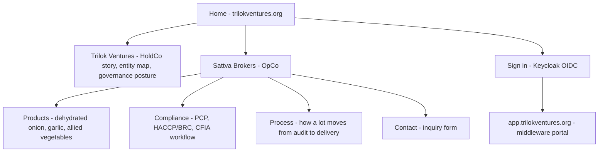

# Public Website + Keycloak Sign-In — Trilok Ventures / Sattva Brokers

**Status:** Proposed (Phase 2–3)
**Date:** 2026-08-14
**Owner:** IPCo (code); Sattva Brokers OpCo (content approval)
**Depends on:** `2026-08-13-sattva-brokers-system-fabric-design.md` (locked), `2026-08-14-integrated-system-architecture.md`, `2026-08-14-middleware-ux-design.md`

This spec defines the **public-facing website** for Trilok Ventures and Sattva Brokers, hosted on Vercel, and its single sign-in path into the middleware portal via Keycloak OIDC.

---

## 1. Purpose and boundaries

| The site does | The site does not |
| --- | --- |
| Present Trilok Ventures (HoldCo) and Sattva Brokers (OpCo) to the public | Hold any RED/AMBER data |
| Tell the compliance-assured brokerage story (products, process, standards) | Become a lead database or CRM (forms email the team; no stored submissions list) |
| Hand authenticated users off to the middleware portal | Implement any portal feature itself |
| Publish GREEN/PUBLIC content approved by humans | Auto-publish Tavily/HF output without review |

**Why separate from the middleware project:** marketing deploys must never risk portal sessions, and the content lifecycle (human-edited copy) differs entirely from the portal's (fabric-bound). Two Vercel projects under team `archneo-6267s-projects` (`team_umcW7U7OAQu6ffIvX8haPgnP`): `trilok-web` (this site) and the future `sattva-portal` (Workstream 2).

## 2. Information architecture

- `/` — group-level landing: who Trilok Ventures is, what it owns, links into Sattva.
- `/sattva` — the OpCo story: compliance-assured import brokerage, Indian manufacturers → Canadian processors.
- `/sattva/products`, `/sattva/compliance`, `/sattva/process` — the PUBLIC/GREEN sales narrative.
- `/contact` — inquiry form (name, company, email, message). Submissions send email via a transactional provider (decision pending; default Resend or equivalent) and are **not** stored in a site database. Odoo lead creation happens only via the n8n inbound workflow if that is approved later — the site itself never writes to Odoo.
- `/signin` — Keycloak handoff (§3).

## 3. Authentication: Keycloak OIDC

**Flow:** "Sign in" → Keycloak `auth.trilokventures.org` authorization-code + PKCE (client `web-public`) → callback establishes a short-lived session → server-side redirect by persona:

| Keycloak groups | Destination |
| --- | --- |
| `sales.exec`, `compliance.officer`, `finance.manager`, `logistics.exec`, `it.admin` | `app.trilokventures.org` (portal dashboard) |
| `buyer` | `app.trilokventures.org/orders` |
| `supplier` | `app.trilokventures.org/documents` |
| none / unknown | back to `/` with "no portal access yet — contact us" |

- The website itself holds **no protected content**; sign-in exists purely to route people to the portal with an identity the fabric trusts.
- Session cookie: `__Host-trilok-session`, `HttpOnly; Secure; SameSite=Lax`, 8h max, encrypted (iron-session or Auth.js equivalent).
- Local development runs in **mock mode**: when `KEYCLOAK_ISSUER` is unset, `/signin` renders a persona picker that sets a local mock session (clearly badged "DEV ONLY" in the UI). No live IdP is needed to build or review the site.
- Production env vars (Vercel project settings, never in git): `KEYCLOAK_ISSUER`, `KEYCLOAK_CLIENT_ID`, `KEYCLOAK_CLIENT_SECRET` (for the confidential exchange if used), `SESSION_SECRET`.

## 4. Content sourcing and the GREEN rule

- Copy lives in the repo as structured content (MDX or a `content/` folder) so changes are PR-reviewed. The Notion Brand & Content hub holds drafts; publishing = a human copies approved text into a PR.
- Only PUBLIC/GREEN content. The compliance page may describe the PCP process and standards (public) but never names suppliers, shows COA data, or exposes lot records.
- Analytics: privacy-respecting, cookieless (e.g. Vercel Web Analytics). No marketing trackers in Phase 2.

## 5. Design language

Shared tokens with the middleware portal (Workstream 2 §6) — same Sattva palette (ink, paper, green/amber/red semantics, HoldCo blue) and Inter type ramp — but the site is marketing-paced: larger type, more whitespace, fewer tables. shadcn/ui + Tailwind. Brand assets (logo) migrate from the LifeOS scratch page per the IPCo note before launch.

## 6. Deployment posture

- **Vercel Git integration:** every PR gets a preview deployment. Production = `main` on the `trilok-web` project, aliased to `trilokventures.org` + `www`.
- **Protected previews:** Vercel Deployment Protection on for previews (team-only) until launch; disabled for production (the site is public by definition).
- **Promotion flow:** PR preview → content approval by OpCo → merge → production. Rollback = `vercel rollback` (instant alias re-point).
- **Domain cutover (Phase 3):** `trilokventures.org` A/ALIAS → Vercel via Cloudflare (grey-cloud DNS-only for the apex to avoid double-proxying Vercel; `www` CNAME likewise DNS-only). Employee app hostnames stay orange-clouded per the integrated architecture §4.7.
- **CI contract:** build must pass with no live IdP (`KEYCLOAK_ISSUER` unset → mock mode) so forks/CI never depend on secrets.

## 7. Error handling

| Failure | Behavior |
| --- | --- |
| Keycloak unreachable at sign-in | Friendly "identity service unavailable" page + retry; public pages unaffected |
| Session expired mid-redirect | Return to `/signin` with a notice |
| Form provider down | Inquiry form shows an email-the-team fallback address; no silent loss |
| 404/500 | Branded error pages with a path back home |

## 8. Testing

- Build passes without secrets (mock mode) — CI gate.
- OIDC flow tested against a local Keycloak container in the Phase 3 plan (docker-compose add-on), not in this scaffold.
- Content pages render statically (SSG); only `/signin` and the auth callback are dynamic.
- Link check + accessibility pass (axe) on preview before production promotion.

## 9. Phasing

- **Phase 2:** static site (all content pages) + `/signin` in mock mode, preview-only. Content approval by OpCo.
- **Phase 3:** production domain, live Keycloak OIDC, persona routing into the portal, inquiry form provider, Cloudflare DNS cutover.

## 10. Out of scope

- Blog/CMS with frequent publishing (evaluate only if marketing cadence demands it; stop-list applies).
- Buyer self-registration (accounts are provisioned, per the UX spec).
- Any authenticated content on the site itself — that is the portal's job.
