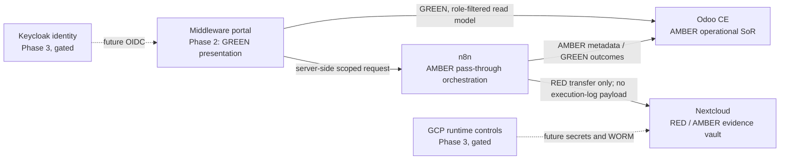

# Middleware Connector Catalogue

**Status:** Draft design — future-state only  
**Date:** 2026-08-16  
**Owner:** Sattva Brokers OpCo (process); IPCo (implementation)  
**Companions:** `2026-08-13-sattva-brokers-system-fabric-design.md`, `2026-08-14-integrated-system-architecture.md`, and `2026-08-16-canada-india-dehydrated-spice-brokerage-library-design.md`

## Purpose

Define the permitted categories of middleware-to-backend connectors for the Sattva Brokers portal. This is a conceptual contract for future phases, not a deployed integration specification. It does not authorize a runtime API, a new system of record, credentials, direct browser access, or an Odoo approval action.

The middleware presents role-filtered GREEN guidance and approved GREEN outcomes. Odoo remains the operational system of record, Nextcloud remains the evidence vault, n8n remains the integration bus, and GCP provides gated runtime controls.

## Connector categories

| Category | Future responsibility | Allowed outcome | Prohibited outcome |
| --- | --- | --- | --- |
| Odoo operational connector | Read role-filtered operational outcomes and submit only approved workflow requests for Odoo evaluation. | GREEN status suitable for the requesting role; Odoo-controlled workflow outcome. | Second CRM, pricing store, approval engine, or bypass of the supplier PO gate. |
| Nextcloud evidence-vault connector | Perform server-side, scoped evidence handoff under a service identity. | Evidence-receipt outcome without exposing source material. | Direct browser connection, credentials, paths, public links, or RED file bytes. |
| n8n orchestration connector | Request approved workflow orchestration and receive sanitized outcomes. | GREEN workflow status or escalation signal. | Customer, lot, invoice, or document-state storage; RED execution-log payloads. |
| GCP runtime-control connector | Describe Phase 3 protected runtime services as an infrastructure boundary. | Gated secret and retention controls operated outside the browser. | Business-state storage, client-side secret access, or a claim that this path is live. |
| Identity boundary | Apply future Keycloak identity and employee-access controls as a cross-cutting boundary. | Role-filtered portal session. | Odoo, n8n, or Nextcloud credentials in a browser. |

## Conceptual information flow

No direct browser-to-Nextcloud or browser-to-GCP control-plane flow is permitted. Middleware must not be represented as the decision-maker for supplier approval, lot release, payment, or any other Odoo-controlled action.

## Contract rules

### Odoo operational connector

- Odoo owns partners, supplier-compliance status, quotes, orders, invoices, lots, and approval state.
- Odoo alone evaluates the existing supplier approval and PO-confirmation control.
- Middleware may present the role-appropriate GREEN result; it cannot infer, replace, or change an approval decision.

### Nextcloud evidence-vault connector

- Evidence handoff is server-side and scoped to the authorized workflow.
- Files and evidence remain in the vault. Middleware returns neither file bytes nor vault-location details.
- A failed or missing evidence handoff becomes an escalation, not an automatic release.

### n8n orchestration connector

- n8n is the sole integration bus for approved process automation.
- It may move RED evidence in transit but must not retain RED payloads in execution logs.
- It returns only sanitized GREEN outcomes or an escalation signal to middleware-facing flows.

### GCP runtime-control connector

- This is a Phase 3 boundary, not an application system of record.
- Secret-management and retained-vault controls remain server-side and gated.
- No browser receives secret, infrastructure, network, or retention-object details.

### Identity boundary

- Future portal sign-in uses role-aware identity. Employee-facing services have a separate access boundary.
- The browser never receives backend credentials.
- Role guidance in middleware is a presentation filter; Odoo remains responsible for operational authorization.

## Preconditions for implementation

1. A human owner promotes the relevant GREEN guidance through the knowledge-base publication process.
2. A separate approved implementation plan defines the authenticated role contract, allowed request types, response classification, error behavior, audit metadata, and RED-key tests.
3. Compliance confirms that no middleware request can approve a supplier, release a quarantined lot, or bypass Odoo controls.
4. Integration workflows are versioned and reviewed before deployment.

## Explicit exclusions

This catalogue contains no credentials, secret names, endpoint URLs, webhooks, ports, IP addresses, service-account identifiers, production hostnames, partner data, live prices, quotations, order data, document files, vault paths, or deployment instructions.
