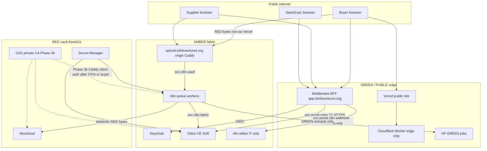

# Internal Services, n8n Workers, and mTLS Pipeline

**Status:** Proposed design (knowledge + architecture; no runtime)  
**Date:** 2026-08-17  
**Owners:** IPCo (service identities, workflow JSON, BFF); AssetCo (secrets, CA, WORM); Sattva Brokers OpCo (buyer/supplier operating process)  
**Repo:** `trilok-ventures/sattva-odoo-infra`  
**Companions:**

- `docs/superpowers/specs/2026-08-13-sattva-brokers-system-fabric-design.md` (locked; wins every conflict)
- `docs/superpowers/specs/2026-08-14-integrated-system-architecture.md`
- `docs/superpowers/specs/2026-08-13-holdco-gcp-vercel-bff-rewire.md`
- `docs/superpowers/specs/2026-08-17-gke-security-test-environment-design.md`
- `docs/superpowers/specs/2026-08-13-supplier-onboarding-chat-collector-design.md`
- `docs/superpowers/specs/2026-08-14-middleware-ux-design.md`

This document defines how Sattva Brokers **employs internal services and workers** inside the existing fabric (Odoo CE, Nextcloud, Keycloak, n8n on GCP, Cloudflare edge, GitHub as source of truth), and how a **mutual-TLS pipeline** is introduced without creating a second system of record or skipping phase gates.

It is a design spec. It does not deploy GKE, stand up a private CA, add Compose services, or write production n8n JSON.

---

## 1. Purpose

Sattva is a CFIA-aligned brokerage. It does not hold inventory. Value is documentation accuracy, supplier vetting, Incoterm coordination, and lot-level traceability. The operating loop stays:

Lead → compliance review → contract → lot quarantine → COA verify → CFIA clear → invoice → 7-year dossier.

The user journeys in §8–§9 are the **product** of that loop for buyers and suppliers. Internal services exist only to move those journeys through the fabric with least privilege, classified data, and auditable identity.

**Done when**

1. Every internal caller has a named service identity, a data class, a system of record, and an ingress/TLS story.
2. “Service worker” and “microservice” mean concrete Sattva components, not a new product category.
3. Service-to-service trust is a **ladder** (network isolation → authenticated HTTPS → origin mTLS). T2 (AssetCo CAS + Caddy client-auth) waits for a live CFIA audit or enterprise buyer. T3 Vault PKI stays parked.
4. Buyer and supplier journeys are mapped onto Odoo stages, Nextcloud folders, n8n pass-through workflows, and middleware **views of Odoo activities** — not onto new CRMs, inboxes, or file stores.
5. Hugging Face, Tavily, Vercel, and any future Vertex job receive GREEN only.

**Success criteria (investor / operator)**

- A sales lead that qualifies for a pitch notifies `sales.exec` on `app.trilokventures.org` without copying RED files to the browser or to a second CRM.
- A buyer can create an account, complete gated onboarding, pick an Incoterm, browse GREEN catalogue cards, and place an order; money, PCP status, and lots still live only in Odoo.
- A supplier cannot become purchasable until a compliance officer sets `supplier_pcp_status = approved`.
- Internal hops that carry AMBER/RED can later require mTLS without rewriting the business workflows.

---

## 2. Hard constraints (locked fabric)

| Rule | Consequence for this spec |
| --- | --- |
| One SoR per domain | No new CRM, ledger, vault, or workflow state store. n8n remains pass-through. |
| RED never leaves vault/KMS/encrypted columns | Browser, Vercel, Hugging Face, Tavily, Cloudflare Workers KV, and Notion do not receive COA bytes, passports, bank details, or vault paths. |
| n8n is the only integration bus | No second bus (Cloudflare Agents SDK, Pub/Sub-as-CRM, ad-hoc Cloud Functions mesh). |
| Stop list | No new tool unless it closes a deal, reduces compliance risk, or shortens the cash cycle. |
| Phase gating | Phase 1 Compose fabric and Phase 2 BFF GREEN contract precede production GCP and mTLS. |
| Digital Trust extras | Vault PKI, Wazuh, mTLS, Tauri wait until Phase 3; mTLS is **not** a Phase 1/2 prerequisite (`2026-08-17-gke-security-test-environment-design.md` §9). |
| Git is canonical | n8n JSON, Keycloak realm exports, service-identity docs, and this spec live in GitHub. Runtime UIs are never SoR. |

If a statement here conflicts with the locked fabric, the fabric wins.

---

## 3. Lexicon (Sattva meanings)

These words are overloaded in industry. In this fabric they mean the following and nothing else.

### 3.1 Internal service

A **named workload identity** that calls another fabric component with a dedicated secret and a documented data class. It is not a new SoR.

Required fields for every internal service (fabric-architect completeness test):

1. Hostname or cluster-internal DNS name
2. Ingress path (or “cluster-internal only”)
3. TLS story (see trust ladder §6)
4. Access policy (who/what may call it)
5. Data classes handled
6. SoR statement (“reads/writes X in Odoo; persists nothing” is valid)

If any field is missing, the service is not approved.

### 3.2 Service worker

One of three allowed worker types:

| Worker | What it does | What it must not |
| --- | --- | --- |
| **n8n queue worker** | Executes Git-reviewed workflow JSON off Redis (`EXECUTIONS_MODE=queue`) | Persist lots, invoices, partner master, or RED payloads in execution logs |
| **GREEN job worker** | n8n calling Hugging Face on GREEN extracts (lead score, OCR numbers) | See vault PDFs, PII, or bank details; Cloud Run is not a Phase 2 runtime |
| **Cloudflare Worker** | Edge: WAF custom rules, bot fight, GREEN/PUBLIC cache, Access JWT checks | Hold business state, call Nextcloud, store AMBER in Workers KV |

**Browser Service Workers** (PWA cache for the public catalogue) are out of scope. Revisit only if a measured GREEN-page performance problem appears after Phase 2.

### 3.3 Microservice

**Rejected as a fleet.** Sattva does not split Odoo into order/catalogue/identity microservices. “Microservice” in conversation maps to an **internal service** (§3.1) plus a worker (§3.2). Adding a new long-lived process requires a stop-list justification and a new dated spec.

---

## 4. Approaches considered

### Approach A — Microservice mesh now

Stand up GKE + Istio/Linkerd, split CRM/orders/catalogue/identity into services, custom Vault PKI, mTLS everywhere on day one.

- **Pros:** Textbook zero-trust; matches older Digital Trust Notion pages.
- **Cons:** Second SoRs; CAD 10k Year-1 capital; skips Phase 1/2 acceptance; contradicts fabric §3.6, §5.11, and GKE-test §9.
- **Verdict:** Rejected.

### Approach B — Edge-native workers as the product

Put buyer onboarding, orders, and notifications in Cloudflare Workers + KV/D1 (or Vercel + Neon). Call Odoo occasionally.

- **Pros:** Fast public UX; cheap edge.
- **Cons:** Second CRM and second database; RED/AMBER at the edge; n8n no longer the only bus; contradicts architecture D6 (Supabase/Neon unassigned) and the two-Vercel-project rule.
- **Verdict:** Rejected.

### Approach C — Named internal services + n8n workers + trust ladder (recommended)

Keep Odoo, Nextcloud, n8n, Keycloak, and the middleware BFF. Give every hop a service identity. Use n8n queue workers for orchestration. Use Cloudflare only as DNS/WAF/Access/edge. Production runtime stays Compose-on-VM (integrated architecture D4). The GKE Autopilot environment is a **synthetic security-test** only and proves **T1** (authenticated HTTPS + service accounts), not mTLS. Introduce Google-managed mTLS (T2) only in Phase 3b after Phase 3a T1 is accepted **and** a live CFIA audit or enterprise buyer requires it.

- **Pros:** Closes deals (notifications + gated onboarding on the existing portal); reduces compliance risk (identity + classification per hop); shortens cash cycle (same SoR, fewer swivel-chair steps). Fits Git promotion. Can add mTLS later without rewriting journeys.
- **Cons:** Not a “pure” microservice story for a pitch deck. mTLS is delayed until an auditor/buyer trigger.
- **Verdict:** **Chosen.**

---

## 5. Architecture

Dashed CAS edges are Phase 3b. Solid edges are the operating design from Phase 1/2 onward with HTTPS + service accounts.

GitHub remains the promotion path for addon source, n8n JSON, realm export, and this spec. Cloudflare proxies employee hostnames with Access; the BFF stays on Vercel (`app.trilokventures.org`) as a **separate** project from the mocks site.

---

## 6. Trust ladder (the mTLS pipeline)

mTLS is a **later rung**, not the foundation. Every internal service is designed so the rung can be raised without changing SoR or workflow JSON business logic.

| Rung | Phase | What authenticates the hop | When it is enough |
| --- | --- | --- | --- |
| **T0** Network isolation | 1 | Docker network `sattva_cloud_net`; no public n8n/Nextcloud | Local fabric proving |
| **T1** Authenticated HTTPS | 2–3a | TLS to origin; Cloudflare Access for employee hostnames; IAP only on the GKE **security-test** path; per-service tokens/API keys from Secret Manager; distinct Odoo/Nextcloud users | Default production on Compose-on-VM. GKE Autopilot security-test proves this rung with synthetic data only. Not a production promotion path. |
| **T2** Google-managed mTLS | 3b | Certificate Authority Service in AssetCo plus origin client-auth (Caddy mTLS on the VM, or Cloud Service Mesh if GKE has already been promoted under the same CFIA/buyer trigger). Browsers never receive client certs. | Phase 3a T1 accepted **and** (live CFIA audit **or** enterprise buyer). Google-managed CA is still PKI and is not exempt from fabric §5.11. GKE security-test must not enable T2. |
| **T3** Custom Vault PKI / Wazuh | parked | HashiCorp Vault, Wazuh SIEM | Not scheduled. Reopen only if T2 cannot satisfy an auditor |

**Pipeline mechanics (T2, when gated in)**

1. AssetCo provisions a CA pool in `tv-assetco` (Canadian region). OpCo workloads get `roles/privateca.certificateRequester` only.
2. Origin services (`svc.n8n.fabric`, `svc.n8n.vault`, Odoo, Nextcloud, Keycloak) receive short-lived client certificates bound to their VM or — only if GKE has been promoted under the same CFIA/buyer trigger — mesh identities. Prefer Caddy client-auth on Compose-on-VM so T2 does not sneak GKE into production.
3. Policy: n8n workers **must** present a client cert to Odoo JSON-2 and Nextcloud WebDAV. The Vercel BFF does **not** join the mesh (D4). Browsers never receive those certs.
4. Certs and keys live in Secret Manager or a CSI driver — never Git, never Notion, never n8n execution logs, never Vercel env.
5. Cloudflare remains the **human** TLS terminator (Full strict + Origin Cert). mTLS is **origin service-to-service**, not browser-to-origin.

**Explicit non-goals for mTLS**

- Client certificates for buyers/suppliers.
- mTLS or WebDAV from Vercel to Nextcloud (RED must not transit the GREEN edge).
- Replacing Keycloak with mutual TLS for human login.
- Enabling T2 inside the GKE security-test cluster.

**Vercel BFF (always T1, GREEN only):** humans authenticate with OIDC. Server-side calls are `svc.portal.odoo` and `svc.portal.n8n` only (HTTPS + service account + Access service token / IP allowlist). RED file bytes never enter Vercel. If origin mTLS later requires a private hop, that hop is a **TLS connector** (Tunnel or a sidecar that forwards T1 BFF calls onto T2). It is not a second BFF, not a second session store, and not a second notification app (D4, D9).

---

## 7. Internal service register

Every row satisfies §3.1. `svc.portal.nc` is **not** a service: RED bytes never transit Vercel.

| ID | Caller → callee | Hostname / ingress | TLS | Access policy | Data class | SoR statement | Phase |
| --- | --- | --- | --- | --- | --- | --- | --- |
| `svc.portal.odoo` | Vercel BFF → Odoo JSON-2 | `sattva.trilokventures.org` via Access service token or origin allowlist; cluster DNS N/A | T1 HTTPS | BFF service account `svc.portal.odoo` only; browsers never see the URL | AMBER in; GREEN/AMBER out per persona | Reads/writes Odoo only; persists nothing | 2 |
| `svc.portal.n8n` | Vercel BFF → n8n webhook | `n8n.trilokventures.org` webhook path, IT Access + webhook HMAC | T1 HTTPS | Metadata/triggers only (record id, sha256, filename, stage). **No file bytes** | AMBER trigger | n8n does not keep business state | 2 |
| `svc.n8n.fabric` | n8n workers → Odoo | Compose-internal / `sattva.` loopback | T0 local; T1 prod; T2 origin after CFIA/buyer | Least-privilege Odoo user `n8n.fabric` | AMBER + GREEN extracts | Pass-through; RED save-data disabled | 1 |
| `svc.n8n.vault` | n8n workers → Nextcloud WebDAV | Compose-internal / `vault.` loopback; **not** reachable from Vercel | T0 local; T1 prod; T2 origin after CFIA/buyer | Nextcloud app-password scoped to `/PCP/`, `/Clients/`, `/Suppliers/` | RED in transit | Move files; Odoo stores path + sha256; log metadata only | 1 |
| `svc.upload.origin` | Browser → origin Caddy → n8n vault hop | `upload.trilokventures.org` (new Caddy vhost on the **VM**, not Vercel). POST only, no listing | T1 HTTPS; Cloudflare Access for Keycloak `buyer` / `supplier` / employees | Minted after BFF metadata call (filename, size, mime, client hash). Max body 100MB. **Bytes never touch Vercel** | RED in transit | Writes via `svc.n8n.vault`; Odoo stores path + sha256 | 2 |
| `svc.leadscore.green` | n8n → Hugging Face → Odoo | Egress to HF; no public hostname | T1 HTTPS to HF | n8n worker only. Allowlist: numeric features, hashes, hashed partner id. **No** names, emails, notes, PDFs | GREEN | Score written to Odoo `crm.lead` | 2 (n8n→HF only; no Cloud Run) |
| `svc.catalogue.green` | BFF → Odoo product (via `svc.portal.odoo`) | Same as `svc.portal.odoo` | T1 | Anonymous: PUBLIC/GREEN cards. Authenticated buyer: GREEN + own AMBER quotes | GREEN / PUBLIC | No separate catalogue DB | 2 |
| `svc.notify.cache` | BFF reads Odoo activities | Same as `svc.portal.odoo` | T1 | Role-filtered. 30-day UI cache of `mail.activity` / chatter. **No unique inbox records** | AMBER pointers | Odoo is SoR; BFF cache is disposable | 2 |
| `svc.kc.oidc` | BFF, Odoo, n8n, Nextcloud → Keycloak | `auth.trilokventures.org`; `/admin` Access-only | T1 | Public login endpoints; confidential clients for origin apps | Identity | Keycloak is IdP, not CRM | 3 |

Hostnames stay as locked (`sattva.`, `vault.`, `n8n.`, `auth.`, `app.`, apex/`www`) plus `upload.trilokventures.org` (D10). Cluster-internal names are unused in production until GKE is promoted under a CFIA/buyer trigger. They are never published in public DNS.

**Upload path (no Vercel WebDAV):**

1. Browser → BFF: metadata only (filename, size, mime, client-computed sha256).
2. BFF → Odoo: create/update the attachment pointer row (hash pending).
3. BFF → n8n: mint a short-lived POST URL on `upload.trilokventures.org`.
4. Browser → origin upload vhost: file bytes. Caddy streams to n8n (`svc.n8n.vault`) → Nextcloud. n8n writes path + verified sha256 to Odoo.
5. BFF reads filename/hash **from Odoo**. It never receives file bytes.

Until `upload.` exists, buyer/supplier collectors are metadata-only (Phase 2 contract tests); employees upload via `vault.` + Access. Buyers and suppliers never receive the vault hostname.

---

## 8. Buyer journey → fabric mapping

Odoo remains SoR for leads, partners, quotes, orders, Incoterms, payment terms, and lots. Nextcloud holds RED onboarding packs. n8n moves events. The middleware dashboard notifies humans. The public site tells GREEN/PUBLIC spice stories.

Authorized communication channels (only):

1. Middleware dashboard notifications that **read Odoo `mail.activity` / chatter** (role-filtered; optional 30-day UI cache, not a second inbox SoR)
2. Odoo email templates fired by n8n (buyer-visible, no vault links)
3. In-portal messages that store a pointer in Odoo chatter

Personal WhatsApp, unlogged SMS, and HubSpot sequences are **not** channels until a later overlay copies contacts **one-way into Odoo**. Dual pipelines stay forbidden.

| Step | Actor | Fabric action | Data class |
| --- | --- | --- | --- |
| Lead qualifies for pitch | `svc.leadscore.green` | Score GREEN allowlist fields on `crm.lead`; if threshold met, create Odoo activity for owning `sales.exec` (stage may move to Proposal). BFF shows that activity | GREEN in; AMBER activity |
| SalesExec contacts buyer | Sales | Uses authorized channel only; Odoo chatter records the touch | AMBER |
| Buyer visits landing | Public | Vercel PUBLIC/GREEN stories (dehydrated spices origins, formats). No account required | PUBLIC / GREEN |
| Buyer creates account | Buyer | Keycloak `buyer` persona (Phase 3); until then mock persona is **not** production. Partner created in Odoo `res.partner` as customer | AMBER identity |
| Gated onboarding | Buyer + BFF + n8n | Scripted collector (same pattern as supplier chat: one field/doc per turn). Explains why each RED/AMBER field is collected, retention (7 years where PCP-relevant), and standards (SFCR, TLS, vault, no public shares). e-sign pointers stored in Odoo. PDFs uploaded via origin n8n (`svc.n8n.vault`) to `/Clients/{name}/Onboarding/`; BFF shows filename + sha256 from Odoo | RED files via n8n; AMBER fields via BFF |
| SalesExec follow-up | n8n | Notify when onboarding pack hash set and status `review`. Sales **cannot** set `approved` for anything that is a supplier gate; for **buyers**, KYC completeness is a sales+compliance checklist, not `supplier_pcp_status` | AMBER |
| Buyer onboarded | Compliance/Sales per RACI | Odoo partner flagged customer-active. No second CRM | AMBER |
| Incoterm browse | Buyer | GREEN/AMBER options from Odoo (company capability list: e.g. EXW, FOB, CIF, DDP as **currently offered** — not a wish list). Selection stored on quote/order | AMBER |
| Catalogue browse | Buyer | GREEN cards: onion, garlic, coriander, chilli, etc.; granule / powder / flakes / mesh. Supplier identity to buyers is display name only | GREEN |
| Place order | Buyer | Custom line (longer lead time) or supplier-offered variant. Creates Odoo `sale.order` in draft/sent. Custom vs offered is an Odoo field, not a new app | AMBER |
| SalesExec order review | Sales | Notify; sales requests changes or sends to compliance/finance. Cannot confirm a linked PO against an unapproved supplier | AMBER |
| Compliance + finance | Officers | Dual control: compliance checks docs/lots; finance checks payment terms. Person who created the commercial record is not sole payment approver | AMBER; RED in vault |
| Forward to supplier | n8n | After approval **and** initial payment confirmation in Odoo: related `purchase.order` still blocked unless supplier `approved` | AMBER |
| Logistics draft | Logistics | 3PL / forwarder routes from Incoterm + onboarding address. Draft delivery in Odoo shipping fields; PDF pack in `/Clients/{name}/Orders/{SO}/` | AMBER; RED docs |
| Buyer confirms delivery | Sales + Buyer | Notify; buyer approval recorded on the order. Execution = Odoo stage Execution | AMBER |
| Delivery confirmation → feedback | n8n | Stage Retention; feedback activity on the order. GREEN NPS-like fields may later feed BI; comments stay AMBER in Odoo | GREEN metrics; AMBER text |

**Buyer KYC vs supplier PCP:** do not reuse `supplier_pcp_status` for buyers. Buyer onboarding completeness is a separate partner flag or activity checklist specified in a later Phase 2 plan. Mixing them would let a customer “approval” accidentally unlock purchase orders.

---

## 9. Supplier journey → fabric mapping

Canonical process remains `2026-08-13-supplier-onboarding-chat-collector-design.md`. This section only shows the worker/notification spine.

| Step | Actor | Fabric action |
| --- | --- | --- |
| Intake | Procurement/Sales or supplier chat | Odoo vendor `pending`; n8n creates `/Suppliers/{name}/Certificates/` |
| Pack upload | Supplier via origin n8n (`svc.n8n.vault`) | RED files in vault; Odoo gets path + sha256; BFF never sees bytes |
| Review | Compliance | `review` (includes conditional/probation). PO still blocked |
| Approved / blocked | Compliance **only** | `approved` unlocks `purchase.order.button_confirm` |
| Offer variants | Supplier | GREEN catalogue fields + offered pack sizes in Odoo product; commercial terms AMBER |
| Receive PO | n8n notify | Only after buyer-side approval + payment confirmation **and** PCP gate |
| COA / lot | Existing proving workflow | Nextcloud COA → n8n OCR GREEN numbers → Odoo lot hash; fail opens CAPA |
| CAPA / ship | Supplier + logistics | Portal P3 CAPA; logistics coordinates Incoterm already chosen on the buyer order |

---

## 10. n8n workflow catalog (Git-owned)

Workflows are named here so implementation plans do not invent a second bus. JSON lands in `n8n/workflows/` under a later plan. UI-only production edits stay forbidden.

| Workflow ID | Trigger | Does | Must not |
| --- | --- | --- | --- |
| `wf.lead.score` | `crm.lead` write / cron | Call `svc.leadscore.green`; notify if threshold | Send notes, emails, or PDFs to HF |
| `wf.notify.role` | Odoo stage or activity | Create/assign `mail.activity` for the mapped role (BFF reads it) | Store a second inbox; store the lead itself |
| `wf.buyer.onboard.folder` | customer partner create | Provision `/Clients/{name}/Onboarding/` | Copy files to Notion |
| `wf.supplier.folder` | vendor create | Existing Phase 1 folder contract | — |
| `wf.coa.verify` | Nextcloud COA upload | Existing proving path | Persist PDF bytes in logs |
| `wf.order.handoff` | sale.order approved + payment flag | Notify compliance/finance/logistics; create PO intent | Auto-confirm PO |
| `wf.delivery.draft` | logistics activity | Notify buyer via Odoo email template | Put vault URLs in email |
| `wf.feedback` | delivery done | Create feedback activity | Publish AMBER comments to Vercel |

RED-touching nodes: save-data on success **and** error disabled (`n8n/workflows/README.md`).

---

## 11. GCP and Cloudflare services in play

Only services that already appear in locked/proposed specs, plus the minimum T2 additions.

| Service | Role | Stop-list test |
| --- | --- | --- |
| Compute Engine Compose-on-VM | Production runtime | Integrated architecture D4 |
| GKE Autopilot | Synthetic security-test only; proves T1; not a production promotion path | Already specified; no live data |
| IAP + Cloud Armor | Human/employee gate on the **GKE security-test** path only | Not Compose-on-VM production extras |
| Secret Manager (AssetCo) | Tokens, encryption keys, future mesh material | Required |
| Cloud SQL or VM Postgres | Odoo / Keycloak / n8n databases | Already specified |
| GCS (+ WORM later) | Vault backend / backups | Retention |
| Artifact Registry + GitHub OIDC/WIF | Promotion | Source of truth |
| Certificate Authority Service | T2 CA after CFIA/buyer | PKI stop list; not in GKE-test |
| Caddy client-auth (VM) | Default T2 service-to-service | Avoids GKE sneak-path |
| Cloud Service Mesh | T2 only if GKE is promoted under the same CFIA/buyer trigger | Not a production default |
| Cloud DLP | Strip RED/AMBER before any Vertex | Phase 3 |
| Hugging Face (GREEN) | OCR numbers, lead score | Closes pitches; GREEN only |
| Cloudflare DNS, WAF, Access, optional Tunnel | Edge and employee ZTNA | Already specified |
| Cloudflare Workers | Edge only (§3.2) | Must not become the bus |

**Not employed:** Pub/Sub as order bus, Cloud Functions mesh, Neon/Supabase, Vault PKI, Wazuh, HubSpot as CRM, Odoo website module, browser mTLS.

---

## 12. Data classification at each hop

| Hop | Allowed | Forbidden |
| --- | --- | --- |
| Browser ↔ Vercel site | PUBLIC/GREEN stories, GREEN catalogue cards | Prices that are AMBER commercial terms for anonymous users; vault paths |
| Browser ↔ BFF | Persona-filtered GREEN/AMBER; Odoo activity views | File bytes, credentials, Nextcloud hostnames, vault paths |
| BFF ↔ Odoo | AMBER fields | File bytes |
| Browser ↔ `upload.` | RED file bytes to origin Caddy | Vercel, n8n editor UI, listing/GET |
| n8n ↔ Nextcloud | RED files in transit | Logging file bytes |
| n8n ↔ HF | GREEN numbers, hashes, hashed partner id | Notes, emails, PDFs, names |
| Notion | Process wiki, this twin | Live orders, COAs, secrets |

---

## 13. Error handling

| Failure | Behaviour |
| --- | --- |
| Lead score job down | Lead stays in Discovery; no silent “qualified” notify |
| Odoo activity create fails | n8n retries 3×; then IT alert; no silent dashboard “notify” |
| Buyer onboarding upload fails | File not in vault; Odoo hash not set; collector stays on that turn |
| Sales tries to confirm PO for `pending` supplier | Existing `UserError`; workflow `wf.order.handoff` must not call confirm |
| Finance and compliance disagree | Order stays in review; no PO intent |
| mTLS cert expired (T2) | Hop fails closed; no HTTP-cleartext fallback |
| RED payload toward HF/Vercel | Drop; classification-violation log (metadata only) |
| Secret missing | Service refuses to start |

Quarantine / review is the default. “Qualified”, “available”, “approved”, and “ship” are affirmative actions.

---

## 14. Testing and acceptance

This spec is accepted as **design** when:

1. Fabric-architect review reports no Critical SoR, classification, gate, or phase violations.
2. Notion twin is linked from System Fabric, Phase Roadmap, and IT & Data Management.
3. Version Catalog row exists with git path (SHA filled after merge).

Runtime tests wait for implementation plans:

| Gate | Evidence |
| --- | --- |
| Phase 1 | Existing fabric §8 plus n8n queue worker processes using Redis; `wf.supplier.folder` + `wf.coa.verify` |
| Phase 2 | BFF contract: no RED keys and no file bytes; buyer collector writes Odoo metadata; uploads (if any) hit `upload.` not Vercel; lead-score GREEN allowlist fixture |
| Phase 3a | T1: distinct `svc.*` secrets in Secret Manager; Cloudflare Access on employee hosts; Compose-on-VM |
| Phase 3b | T2 only after live CFIA audit or enterprise buyer. Origin client-auth denies a worker with a missing client cert. GKE security-test remains T1 synthetic-only. |

---

## 15. Phase plan (no calendar estimates)

1. **Now (this spec):** lexicon, register, journeys, trust ladder. No Compose/GCP/mTLS changes.
2. **After Phase 1 local fabric acceptance:** implement n8n workers + folder/COA workflows already specified.
3. **After Phase 2 BFF acceptance:** `wf.lead.score`, `wf.notify.role`, buyer collector, GREEN catalogue.
4. **After Phase 3a runtime:** T1 service accounts everywhere.
5. **T2 mTLS:** Phase 3a T1 accepted **and** a live CFIA audit or enterprise buyer is recorded in the Decisions log. Prefer Caddy client-auth on the VM. Do not enable mTLS in the GKE security-test.

---

## 16. Decision register

| # | Decision | Choice | Rejected | Rationale |
| --- | --- | --- | --- | --- |
| D1 | Shape of “microservices” | Named internal services + n8n/GREEN/CF workers | Odoo-splitting mesh; edge KV CRM | Stop list + one SoR |
| D2 | Service workers | n8n queue workers primary; CF Workers edge-only; optional GREEN jobs | Browser SW as architecture; Workers as bus | n8n is the only bus |
| D3 | mTLS timing | T0→T1 operating ladder. T2 = AssetCo CAS + Caddy client-auth on the VM after CFIA audit or enterprise buyer | Vault PKI now; browser mTLS; T2 in GKE-test; synthetic-mesh OR | Fabric §5.11; GKE-test §9 |
| D4 | BFF vs mesh | Vercel BFF stays T1 forever. An origin TLS connector (if needed) is not a second app | Mesh client certs in Vercel; in-cluster BFF replica | GREEN edge must not hold Origin CA or RED |
| D5 | Buyer vs supplier gates | Separate buyer KYC checklist; do not reuse `supplier_pcp_status` | One status field for both | Would unlock POs accidentally |
| D6 | Comms channels | Odoo `mail.activity` + email + chatter; BFF is a view | WhatsApp/HubSpot as SoR; portal-local inbox SoR | Dual pipeline ban |
| D7 | Lead scoring | n8n → HF GREEN allowlist → Odoo score → activity | LLM on notes/PDFs; Cloud Run in Phase 2 | Classification + phase gating |
| D8 | Catalogue | Odoo products via BFF GREEN cards | Separate catalogue DB | One SoR |
| D9 | Notifications | Odoo activities are SoR; BFF cache optional and empty-able | `svc.notify.inbox` as unique records | One SoR |
| D10 | Buyer/supplier uploads | Origin vhost `upload.trilokventures.org` | BFF/Vercel WebDAV (`svc.portal.nc`) | RED must not transit Vercel |

---

## 17. Scope boundary

**In scope:** this spec, Notion knowledge capture, catalog/decision rows, hub links.

**Out of scope until an approved implementation plan:** Compose diffs, GKE manifests, CAS pools, `upload.` Caddy vhost, n8n JSON bodies, Keycloak realm edits, buyer KYC field list, Incoterm capability master data, 3PL carrier APIs, WhatsApp, HubSpot, Tauri, Wazuh, Vault PKI, rewriting department databases.

---

## 18. Related knowledge (do not duplicate)

| Topic | Canonical |
| --- | --- |
| SoR, RED/GREEN, stop list | Locked fabric spec |
| Hostnames, Keycloak clients, Compose-on-VM | Integrated architecture |
| Two Vercel projects | HoldCo GCP/Vercel BFF rewire |
| GKE proving env; mTLS deferred | GKE security-test design |
| Supplier collector | Supplier onboarding chat spec |
| Portal personas | Middleware UX spec (inbox = Odoo activity view, not a second SoR) |
| BFF document upload | D10 **supersedes** middleware UX `POST /api/documents` WebDAV-through-BFF. That spec remains UI-only until a plan implements `upload.` |
| Older Digital Trust / HAProxy mTLS sketches | Historical Notion; this spec supersedes them for Sattva runtime |

---

## 19. Published copies

Canonical git copy: this file.

Notion twin: [Internal services, n8n workers, and mTLS pipeline](https://app.notion.com/p/3bfe8d8c60c781e5a930fe24c7ee60c3) (System Fabric child).

Linked from: System Fabric, Phase Roadmap, Decisions, IT & Data Management, Version Catalog, Decisions log.
