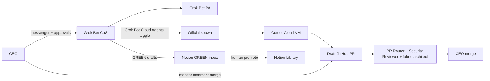
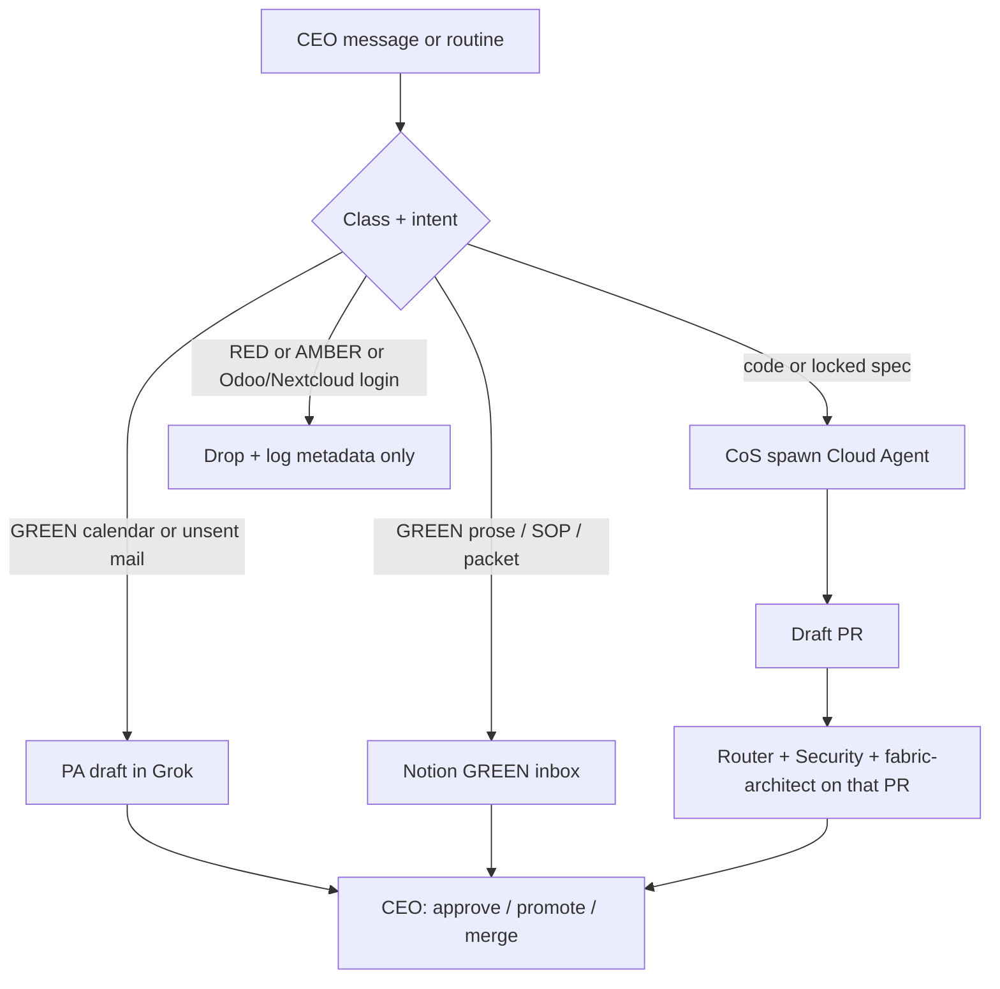

# Dual-Plane CEO Desk

**Status:** Proposed (Phase 0 operating model for CEO agents)  
**Date:** 2026-08-18  
**Owner:** IPCo (agent operating model); Sattva Brokers OpCo (human gates)  
**Repo:** `trilok-ventures/sattva-odoo-infra`  
**Companion specs:** `2026-08-13-sattva-brokers-system-fabric-design.md` (locked), `2026-08-13-sattva-versioned-kb.md` (locked), `2026-08-14-integrated-system-architecture.md`, `2026-08-14-ceo-command-center-blueprint.md`  
**Does not replace:** the locked fabric, the versioned KB, or the CEO Command Center (Notion presentation layer).

This document is the git-canonical design for how the CEO of Trilok Ventures uses **Grok Bot** and **Cursor Cloud Agents** together. Locked fabric wins any conflict.

---

## 1. Purpose

Give the CEO a small, human-governed agent desk that:

1. handles always-on GREEN operations (calendar, unsent drafts, cadence reminders);
2. turns a justified coding ticket into an isolated Cloud Agent and a draft GitHub PR;
3. lets the CEO **monitor, modify, and evaluate** that work without a new system of record.

**Done when**

1. Two named Grok Bots exist (Chief of Staff, PA) with standing deny rules and approval gates.
2. CoS can spawn a Cursor Cloud Agent whose only durable output is a draft PR on this repo.
3. Pull Request Router and Security Reviewer comment on the **triggering** PR.
4. Agent prose lands only in Notion GREEN Content **inbox**; a human promotes to Library after `red_scan = clear`.
5. No Grok Bot or Cloud Agent holds Odoo or Nextcloud credentials, confirms a PO, or treats Bot memory as a file.

**Stop-list justification (fabric §3.6):** classification plus human gates **reduce compliance risk**; spawning a Cloud Agent instead of the CEO copy-pasting **shortens the cash cycle** when the ticket unblocks a deal, CFIA request, or quote. This design does not add a CRM, warehouse, vault, or second bus.

**Not in this spec:** market-research / investor-brief cells, Deal Brief and Compliance Brief specialists, a 10-bot Grok org, live Odoo metrics, GKE, HubSpot, RAG on COAs. Those need a later dated spec.

---

## 2. Architecture

Two planes, one human, no new SoR. Name: **Dual-plane desk.**

| Plane | Job | Durable artifact | Must not |
| --- | --- | --- | --- |
| **Grok Bot** | Always-on CoS + PA. Routines, group chat, approval cards. | Threads (ephemeral) + Notion GREEN inbox drafts | Odoo, Nextcloud, Bot memory or `/workspace` as SoR, AMBER in pings |
| **Cursor Cloud** | Coding only, on spawn | `cursor/*` branch + draft PR | Merge to `main`; Odoo writes; vault files |
| **GitHub** | **IPCo / agent-eval bus** only | PR comments + merge | Operational integration bus (that remains n8n) |
| **Notion GREEN Content** | Agent prose write | Inbox row; Library only after human promote | CRM, tasks, live KPIs |
| **CEO** | Judgment, promote, merge, send | Existing decisions log | Copy-paste router between planes |
| **n8n** | Operational integration bus | Git-versioned workflow JSON; pass-through only | Agent chat; business state |

Grok/xAI is a **GREEN-only destination**, same class as Hugging Face and Tavily (fabric §3.3). Partner names, prices, Odoo URLs, weekly AMBER Command Center content, and vault pointers must not enter Grok or Cloud Agent context.

The Grok Bot computer is SpaceXAI’s **user-scoped Linux VM** (one per Cursor member, shared by that member’s Bots). It is **not** the Compose/Odoo/Nextcloud/n8n host and must not be colocated with those services.

The Dual-plane desk is the **agent operating model**. The CEO Command Center remains the **Notion presentation layer**. Do not merge them.

---

## 3. Components

First roster: **two Grok Bots + on-demand Cloud Agents + two existing automations**. Coding specialists are ephemeral Cloud Agents, not standing Grok Bots.

### 3.1 Grok Bot plane

One shared Grok VM per CEO Cursor account. Specialist Bots are **not** a security boundary: cookies, files, and CLI creds are account-wide. Treat the whole roster as **one principal**.

| Bot | Always-on | Does | Does not |
| --- | --- | --- | --- |
| **Chief of Staff** | Yes. Cadence routines + ad-hoc. | GREEN reminders; `@` the PA; spawn a Cloud Agent with a written brief; ping the CEO for judgment only. Doorbell = title + Notion or PR URL. | Log into Odoo/Nextcloud. Write code on the Grok VM. Send email. Invent KPIs. |
| **PA** | Yes, behind CoS. | Calendar, follow-ups, “show me once” routines on **non-secret** UIs (Gmail/calendar). Drafts stay unsent until CEO approval. | Vault browsing. CRM writes. LifeOS. |

Standing rules live in each Bot **description** (not only chat):

- never send, purchase, publish, or delete without an approval card;
- never log into Odoo or Nextcloud;
- never paste secrets;
- never OCR, summarize, or store COA PDFs or vault bytes;
- Require Approval beats Always Allow for send / publish / delete;
- Auto-review **Deny** for any navigation to Odoo, Nextcloud, Keycloak admin, production n8n, or Secret Manager.

Teach-a-task is allowed only on non-secret UIs. Test runs perform real writes — do not test on production mail “just to see.”

### 3.2 Cursor Cloud plane

| Piece | Role |
| --- | --- |
| **Spawned Cloud Agent** | Isolated Ubuntu VM, `cursor/*` branch, draft PR. Spawn uses Grok Bot’s documented Cloud Agents toggle (team default on). |
| **`fabric-architect`** | In-repo guardian at `.cursor/agents/fabric-architect.md`. The spawned agent must invoke it on diffs that touch Odoo, n8n, Nextcloud, Keycloak, GCP, Cloudflare, Vercel, classification, or secrets. |
| **Pull Request Router** | Cursor Automation `c8a92dde-9421-11f1-ba66-0e7d0216e441`. Must **comment on the triggering PR**. Must not open unused `cursor/pr-approval-agent-logic-*` branches with no diff. |
| **Security Reviewer** | Cursor Automation `c88e8a91-9421-11f1-ba66-0e7d0216e441`. Same landing rule: comment on the triggering PR, no orphan branches. |
| **CEO** | Merges. Agents never merge `main`. |

Cloud Agent spawn must not inherit Odoo, Nextcloud, vault, HubSpot, or Secret Manager access. Git access is at most the triggering user’s GitHub access.

### 3.3 Knowledge and bind

| Piece | Role |
| --- | --- |
| **Notion GREEN Content inbox** | Only agent write for prose. Human `red_scan` then Library. Packets use `as of` and **Not instrumented** for any Odoo metric. |
| **`sattva-fabric-bind` plugin** | Out of this spec’s runtime. Later IPCo git tree: always-apply rule + `/sattva-route` skill. Not an agent, not a hook, not MCP to Odoo/Nextcloud. Canonical copy in git; `~/.cursor/plugins/local/` is a derived install. |
| **n8n** | Unchanged. Pass-through for files and Odoo GREEN flags. Not in the agent chat. n8n OCR of COA PDFs (versioned workflow) remains the proving path; LLM agents must not OCR those PDFs. |

### 3.4 Explicit non-components

Ten-bot Grok group; specialist Bots as isolation; Grok coding on `/workspace` as SoR; Odoo/Nextcloud MCP; Notion CRM/task/metric warehouse; RAG on COAs; agent-written dashboards; Cloudflare Agents SDK; HubSpot as CRM; a new approval-card database.

---

## 4. Data flow

Three allowed paths. Everything else is a drop. Agents may **cite** inbox page IDs and PR URLs. They may not pass RED/AMBER payloads through Grok memory, group DMs, or `/workspace`.

**Path A — PA (ops).** CoS `@` PA. PA drafts in-thread. Approval card before send. Artifact is the Grok thread, not a database. Doorbell to the CEO is title + link only.

**Path B — knowledge.** CoS writes a GREEN Content inbox row: Classification `GREEN` or `PUBLIC`; Status `inbox`; `kb_layer` `inbox`; `red_scan` `unscanned`; `agent_ok` unset or false until a human publishes; source `git-spec` when the draft points at this spec, otherwise `human` or `tavily` as appropriate. CEO runs `red_scan` and promotes. Agents never edit Published library pages.

**Path C — code.** CoS spawns a Cloud Agent. The spawn brief is a GREEN object with these fields and no others of consequence:

| Field | Required value |
| --- | --- |
| Goal | One sentence |
| Stop-list | `deal` / `compliance` / `cash-cycle` — pick one |
| Paths | Repo paths to touch |
| Inputs | GREEN/PUBLIC + `agent_ok` + Published only |
| Done | Draft PR + tests/logs that prove it |
| Forbidden | Odoo write, Nextcloud, secrets, merge `main` |

Cloud Agent: isolated VM → `cursor/*` → draft PR. Router and Security Reviewer comment **on that PR**. `fabric-architect` runs on fabric-touching diffs. CEO merges. After merge, CoS may drop a GREEN inbox pointer (PR URL + SHA) with no AMBER paraphrase.

**Read contract (both planes, KB §8):** `agent_ok = true` **and** classification GREEN or PUBLIC **and** catalog/KB Status Published. LifeOS is out of scope.

**Write contract:** GREEN Content inbox only. Never Odoo. Never Nextcloud. Never Published library.

### 4.1 Classification at every hop

| May flow | Must not flow |
| --- | --- |
| GREEN/PUBLIC Published, `agent_ok` | RED: COA bytes, vault paths, bank details, PII, full lab reports |
| PR diffs, git SHAs, inbox page IDs | AMBER: partner names, prices, Incoterms, Odoo URLs, weekly Command Center internals in Slack/Grok pings or investor copy |
| n8n GREEN hashes already on the lot | Agent OCR of PDFs; HubSpot dumps; LifeOS; secrets in prompts |

Grok transcripts, xAI logs, and Cloud Agent transcripts are **not** stores. Durable output is PR + GREEN inbox + the product approval card on the action (eval artifact, not SoD).

---

## 5. Human monitor / modify / evaluate

| Intent | Grok Bot plane | Cursor Cloud plane |
| --- | --- | --- |
| **Monitor** | Messenger thread, Needs attention, Agent Computer live preview, routine history (desktop) | `https://cursor.com/agents/<bcId>`, draft PR, automation comments |
| **Modify** | Bot description, skills/routines, Auto-review rules, plugin/MCP allowlist, “Stop now,” Reset computer | PR comments, `AGENTS.md`, `fabric-architect.md`, automation prompt/trigger in Cursor UI |
| **Evaluate** | Approval card (Allow once / Deny / Always allow). Cards do not undo completed work. | Merge = pass. Request changes = fail. Five-check rubric below. |

Bot-action audit is **unreleased**. Do not claim CFIA-grade Grok logging. Eval = PR + inbox + approval cards until a dated spec records that audit shipping.

---

## 6. Error handling

Fail closed. Approval does not reverse work already done.

| Condition | Response |
| --- | --- |
| RED or vault bytes in a prompt, screenshot, or Grok `/workspace` | Drop. Point to Nextcloud. Do not summarize. Decisions-log incident. Reset the Grok VM if a session may exist. |
| AMBER in Slack/Grok ping | Do not send. Rewrite to title + inbox/PR URL. Disable body on that routine. |
| CoS or PA navigates to Odoo/Nextcloud | Description + Auto-review Deny. If human takeover already typed a password: sign out, Reset computer, incident. |
| Spawn brief missing stop-list, paths, or forbidden | Cloud Agent refuses to start. CoS rewrites the brief. |
| Cloud Agent cannot prove the change | Draft PR may still open; reviewers request changes; CEO does not merge. |
| Automations open orphan branches | Eval chain is broken. Fix landing onto the triggering PR before claiming the desk works. |
| Inbox draft fails `red_scan` | Stay inbox. Never promote. |
| Odoo metric wanted in a packet | **Not instrumented**. Never estimate. |
| Closed teamspace still missing | GREEN inbox only. No AMBER weekly Command Center. Do not invite bots workspace-wide. |
| Secrets in chat | Refuse. Secrets stay in Secret Manager. |

**Agent denylist (Odoo / money / lots) — not only PO confirm:**

Agents must not set `supplier_pcp_status`, confirm `purchase.order`, release lots, post invoices, approve payment, or edit price lists. Zero Odoo/Nextcloud credentials, including API keys and n8n invocations of `button_confirm` from an LLM agent.

---

## 7. Eval rubric

Fail any check → do not promote, send, or merge.

1. **Stop-list** — the artifact moves a deal step, a compliance control, or the cash cycle.
2. **Classification** — reads `agent_ok` + GREEN/PUBLIC + Published; writes inbox or a PR; never COA/PII/vault.
3. **One SoR** — Odoo = money/partners; Nextcloud = files; GitHub = code; Notion = knowledge; n8n = pass-through. No Notion CRM, no Bot memory as file, no live KPIs.
4. **Human gate** — CEO promotes / merges / sends. PCP, PO confirm, lot release, payment stay human in Odoo.
5. **Span** — two Grok Bots, one spawn per ticket, one doorbell ping. Do not staff up on failure.

**Kill switch:** if for two consecutive weeks desk prep costs more CEO time than it saves, pause routines. Do not add Bots.

---

## 8. Testing

No fake dashboards. No live Odoo KPI claims.

| Proof | Pass |
| --- | --- |
| PA path | Unsent draft + approval card. Deny works. Mail is not Always Allow. |
| Knowledge path | Inbox row created; Published library unchanged; planted AMBER string is `flagged` and not promoted. |
| Code path | CoS spawn → draft PR → Router **and** Security comments **on that PR** → `fabric-architect` note if fabric files changed → CEO merges. |
| Negative spawn | Brief containing “log into Odoo” is refused. |
| Negative Grok | Routine that would open Nextcloud is denied. |
| Isolation | Grok VM has no Odoo/Nextcloud session cookies after Reset. |

**Out of scope for this spec’s tests:** live Odoo KPIs, investor AMBER pack, n8n COA OCR fixtures (separate fabric proving path).

---

## 9. Phased delivery

| Phase | Dual-plane desk may | Dual-plane desk must not |
| --- | --- | --- |
| **0** (this spec) | Configure two Bots; GREEN inbox drafts; spawn Cloud Agents on this git repo; fix automation landing; document standing rules | Compose/Grok colocation; fabric credentials; live metric claims; workspace-wide bot invites |
| **1** | Same, after local fabric acceptance. n8n COA workflow remains n8n, not Grok. | Agents writing Odoo; weakening the PCP gate |
| **2** | Tavily → inbox (human promote). Vercel GREEN/PUBLIC only. | Browser Nextcloud; AMBER on Vercel |
| **3** | Same classification under Keycloak. Vertex only after DLP strips RED/AMBER. | Digital Trust extras unless audit/buyer requires them |

---

## 10. Implementation notes (not this change)

This commit is **spec only**. A later implementation plan (writing-plans) should cover, in order:

1. Decision-log row: Dual-plane desk; Bots are not a security boundary; Grok is GREEN-only.
2. Bot descriptions + Auto-review Deny list + Cloud Agents spawn enabled for CoS only.
3. Re-point Pull Request Router and Security Reviewer onto the triggering PR.
4. One spawn dry-run that opens a no-op or docs PR and receives both automation comments.
5. Optional later: git-canonical `plugins/sattva-fabric-bind/` (rule + `/sattva-route` only).

Do not implement those in the same change as this file.

---

## 11. Scope

**In scope:** this operating model, two Grok Bots, Cloud Agent spawn, PR eval, GREEN inbox writes, fail-closed rules, test proofs.

**Out of scope:** Deal Brief / Compliance Brief / investor-analyst always-on bots; Command Center live metrics; binder plugin files; automation prompt text (not readable from MCP at design time — fix in Cursor Automations UI); Enterprise Grok Bot waitlist; Bot-action audit (record when shipped).

---

## 12. Invariants

Keep these verbatim in any later plan or plugin:

- Dual-plane: Grok Bot (CoS + PA, one shared VM) = always-on **GREEN** ops; Cursor Cloud Agents = code via **official Grok spawn**; GitHub PR = IPCo/agent-eval bus; Notion GREEN Content inbox = **only** agent prose write; human promotes / merges / sends.
- No Odoo/Nextcloud Grok logins.
- No agent PO confirm.
- No RAG on COAs.
- No Notion CRM.
- n8n stays pass-through.
- Automations comment on the triggering PR, not orphan branches.
- Specialist Bots are not a security boundary.
- Bot-action audit unreleased, so eval = PR + inbox + approval cards.
- Not a new SoR.
